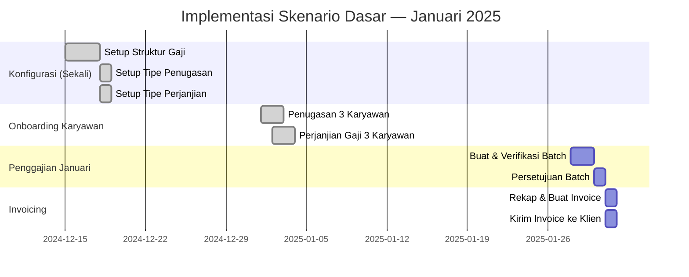

# Skenario Dasar: Satu Klien, Beberapa Karyawan

Skenario ini menggambarkan implementasi lengkap untuk sebuah **perusahaan outsourcing kecil** yang menempatkan karyawannya di satu klien.

---

## Profil Skenario

| | Detail |
|---|---|
| **Vendor (Perusahaan Outsourcing)** | PT. Maju Bersama |
| **Klien** | PT. Karya Utama (pabrik manufaktur) |
| **Jumlah Karyawan** | 3 orang operator produksi |
| **Periode** | Januari 2025 |
| **Kebutuhan** | Proses gaji bulanan dan tagih ke klien |

---

## Data Karyawan

| Karyawan | Posisi | Gaji Pokok | T. Transportasi | T. Makan | Total Gross |
|---|---|---|---|---|---|
| Budi Santoso | Operator Produksi | Rp 4.000.000 | Rp 500.000 | Rp 300.000 | Rp 4.800.000 |
| Sari Dewi | Operator Produksi | Rp 3.800.000 | Rp 500.000 | Rp 300.000 | Rp 4.600.000 |
| Ahmad Fauzi | Operator Produksi | Rp 4.200.000 | Rp 500.000 | Rp 300.000 | Rp 5.000.000 |

---

## Implementasi Langkah demi Langkah

### Tahap 1: Konfigurasi Awal (Dilakukan Sekali)

**1.1 — Konfigurasi Struktur Gaji**

Buat struktur gaji `Gaji Operator Produksi` dengan komponen:

| Komponen | Cara Hitung |
|---|---|
| Gaji Pokok | Dari input perjanjian |
| Tunjangan Transportasi | Dari input perjanjian |
| Tunjangan Makan | Dari input perjanjian |
| BPJS Kesehatan Karyawan | 1% × Gaji Pokok |
| BPJS Kesehatan Perusahaan | 4% × Gaji Pokok |
| BPJS TK JHT Karyawan | 2% × Gaji Pokok |
| BPJS TK JHT Perusahaan | 3.7% × Gaji Pokok |
| Gaji Bersih | Gross − Potongan |

**1.2 — Konfigurasi Tipe Penugasan**

| Field | Nilai |
|---|---|
| Nama | `Penugasan Operator - Klien Industri` |
| Filter Karyawan | Semua karyawan dengan jabatan Operator |
| Filter Klien | Semua mitra dengan industri Manufaktur |

**1.3 — Konfigurasi Tipe Perjanjian**

| Field | Nilai |
|---|---|
| Nama | `Perjanjian Outsource Operator` |
| Format Nomor | `PA-OP/%(year)s/%(month)s/%(seq)s` |

---

### Tahap 2: Onboarding Karyawan (Dilakukan Saat Karyawan Bergabung)

#### 2.1 — Penugasan Budi Santoso

Karena ketiga karyawan baru bergabung di bulan yang sama, buat tiga dokumen penugasan:

**Penugasan 1 — Budi Santoso**

| Field | Nilai |
|---|---|
| Tipe Penugasan | `Penugasan Operator - Klien Industri` |
| Karyawan | `Budi Santoso` |
| Klien | `PT. Karya Utama` |
| Tanggal Mulai | `01/01/2025` |

Proses: Konfirmasi → Setujui → **Status: Aktif**

Ulangi untuk **Sari Dewi** dan **Ahmad Fauzi** dengan data yang sama (kecuali nama karyawan).

---

#### 2.2 — Perjanjian Gaji Budi Santoso

**Perjanjian — Budi Santoso**

| Field | Nilai |
|---|---|
| Tipe Perjanjian | `Perjanjian Outsource Operator` |
| Karyawan | `Budi Santoso` |
| Tanggal | `01/01/2025` |
| Struktur Gaji | `Gaji Operator Produksi` |

**Input Perjanjian:**

| Input | Nilai |
|---|---|
| Gaji Pokok | Rp 4.000.000 |
| Tunjangan Transportasi | Rp 500.000 |
| Tunjangan Makan | Rp 300.000 |

Proses: Konfirmasi → Setujui → Aktifkan → **Status: Aktif**  
Nomor digenerate: `PA-OP/2025/01/0001`

**Ulangi untuk Sari Dewi** (Gaji Pokok: Rp 3.800.000) → Nomor: `PA-OP/2025/01/0002`

**Ulangi untuk Ahmad Fauzi** (Gaji Pokok: Rp 4.200.000) → Nomor: `PA-OP/2025/01/0003`

---

### Tahap 3: Pemrosesan Gaji Januari 2025

#### 3.1 — Buat Batch Gaji

| Field | Nilai |
|---|---|
| Nama | `Gaji Januari 2025 - PT. Karya Utama` |
| Tipe Slip Gaji | `Slip Gaji Bulanan` |
| Periode | `01/01/2025 – 31/01/2025` |
| Karyawan | Budi Santoso, Sari Dewi, Ahmad Fauzi |

Klik **Buka Batch** → 3 slip gaji tergenerate otomatis.

#### 3.2 — Verifikasi Slip Gaji

Cek slip gaji Budi Santoso:

| Komponen | Nilai Terhitung | Status |
|---|---|---|
| Gaji Pokok | Rp 4.000.000 | ✓ Benar |
| Tunjangan Transportasi | Rp 500.000 | ✓ Benar |
| Tunjangan Makan | Rp 300.000 | ✓ Benar |
| BPJS Kesehatan Karyawan | Rp 48.000 | ✓ Benar (1% × 4jt) |
| BPJS TK JHT Karyawan | Rp 96.000 | ✓ Benar (2% × 4jt) |
| **Gaji Bersih** | **Rp 4.656.000** | ✓ Benar |

#### 3.3 — Konfirmasi dan Setujui Batch

Klik **Konfirmasi Batch** → Manajer mereview → Klik **Setujui**

Hasil:
- 3 slip gaji berstatus **Selesai**
- Jurnal akuntansi biaya gaji terbuat otomatis

---

### Tahap 4: Invoice ke PT. Karya Utama

#### 4.1 — Rekap Biaya Gaji

| Karyawan | Total Gross | BPJS Perusahaan | Total Beban |
|---|---|---|---|
| Budi Santoso | Rp 4.800.000 | Rp 388.000 | Rp 5.188.000 |
| Sari Dewi | Rp 4.600.000 | Rp 370.000 | Rp 4.970.000 |
| Ahmad Fauzi | Rp 5.000.000 | Rp 407.000 | Rp 5.407.000 |
| **Total** | **Rp 14.400.000** | **Rp 1.165.000** | **Rp 15.565.000** |

#### 4.2 — Perhitungan Nilai Invoice

| Item | Nilai |
|---|---|
| Total Beban Gaji | Rp 15.565.000 |
| Biaya Administrasi (5%) | Rp 778.250 |
| Margin (10%) | Rp 1.556.500 |
| **Subtotal** | **Rp 17.899.750** |
| PPN 11% | Rp 1.968.973 |
| **Total Invoice** | **Rp 19.868.723** |

#### 4.3 — Buat Invoice di Odoo

**Invoice:**

| Field | Nilai |
|---|---|
| Pelanggan | `PT. Karya Utama` |
| Tanggal | `31/01/2025` |
| Jatuh Tempo | `28/02/2025` |

**Baris Invoice:**

| Deskripsi | Qty | Harga | Total |
|---|---|---|---|
| Jasa TK Outsource Operator - Budi Santoso - Jan 2025 | 1 | Rp 5.966.583 | Rp 5.966.583 |
| Jasa TK Outsource Operator - Sari Dewi - Jan 2025 | 1 | Rp 5.720.833 | Rp 5.720.833 |
| Jasa TK Outsource Operator - Ahmad Fauzi - Jan 2025 | 1 | Rp 6.212.333 | Rp 6.212.333 |
| **Subtotal** | | | **Rp 17.899.750** |

Klik **Konfirmasi** → Kirim ke PT. Karya Utama.

---

## Ringkasan Timeline Skenario Ini

---

!!! success "Skenario Berhasil"
    Dengan 3 karyawan di 1 klien, seluruh proses dari onboarding hingga invoice membutuhkan sekitar **1–2 minggu** untuk konfigurasi awal, dan sekitar **3–5 hari kerja** untuk siklus penggajian bulanan berikutnya.
