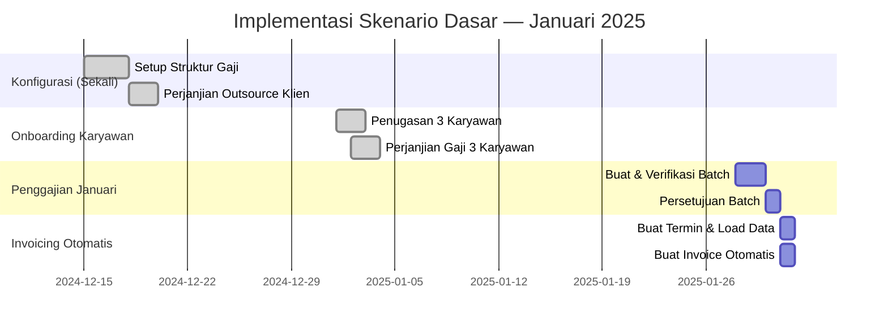

# Skenario Dasar: Satu Klien, Beberapa Karyawan

Skenario ini menggambarkan implementasi lengkap untuk sebuah **perusahaan outsourcing kecil** yang menempatkan karyawan di satu klien, mencakup seluruh alur dari pembuatan perjanjian outsource hingga invoice dikirim ke klien.

---

## Profil Skenario

| | Detail |
|---|---|
| **Vendor (Perusahaan Outsourcing)** | PT. Maju Bersama |
| **Klien** | PT. Karya Utama (pabrik manufaktur) |
| **Jumlah Karyawan** | 3 orang operator produksi |
| **Periode** | Januari 2025 |

---

## Data Karyawan

| Karyawan | Posisi | Gaji Pokok | T. Transportasi | T. Makan | Total Gross |
|---|---|---|---|---|---|
| Budi Santoso | Operator Produksi | Rp 4.000.000 | Rp 500.000 | Rp 300.000 | Rp 4.800.000 |
| Sari Dewi | Operator Produksi | Rp 3.800.000 | Rp 500.000 | Rp 300.000 | Rp 4.600.000 |
| Ahmad Fauzi | Operator Produksi | Rp 4.200.000 | Rp 500.000 | Rp 300.000 | Rp 5.000.000 |

---

## Implementasi Lengkap

### Tahap 1: Konfigurasi Awal (Dilakukan Sekali)

**1.1 — Konfigurasi Struktur Gaji**

Buat struktur `Gaji Operator Produksi` dengan komponen:

| Komponen | Cara Hitung |
|---|---|
| Gaji Pokok | Dari input perjanjian karyawan |
| Tunjangan Transportasi | Dari input perjanjian karyawan |
| Tunjangan Makan | Dari input perjanjian karyawan |
| BPJS Kesehatan Karyawan | 1% × Gaji Pokok |
| BPJS Kesehatan Perusahaan | 4% × Gaji Pokok |
| BPJS TK JHT Karyawan | 2% × Gaji Pokok |
| BPJS TK JHT Perusahaan | 3.7% × Gaji Pokok |
| Gaji Bersih | Gross − Potongan |

**1.2 — Konfigurasi Komponen Gaji untuk Invoicing**

Setiap komponen yang akan ditagihkan ke klien perlu memiliki **produk** yang menjadi baris invoice:

| Komponen Gaji | Produk Invoice |
|---|---|
| Gaji Pokok | `Biaya Gaji Pokok Outsource` |
| Tunjangan Transportasi | `Biaya Tunjangan Outsource` |
| Tunjangan Makan | `Biaya Tunjangan Outsource` |
| BPJS Kesehatan Perusahaan | `Biaya BPJS Outsource` |
| BPJS TK JHT Perusahaan | `Biaya BPJS Outsource` |

---

### Tahap 2: Buat Perjanjian Outsource dengan PT. Karya Utama

**Menu:** `Human Resources > External Assignment > Agreements > Baru`

| Field | Nilai |
|---|---|
| Tipe Perjanjian | `Outsourcing Operator Produksi` |
| Judul | `Perjanjian Penyediaan Tenaga Kerja 2025` |
| Klien | `PT. Karya Utama` |
| Tanggal Mulai | `01/01/2025` |
| Tanggal Selesai | `31/12/2025` |
| Jurnal Invoice | `Jurnal Penjualan` |
| Akun Piutang | `113100 - Piutang Usaha` |

**Detail Posisi:**

| Posisi | Kuota |
|---|---|
| Operator Produksi | 5 orang |

**Termin Kompensasi untuk Operator Produksi:**

| Komponen | Min | Max |
|---|---|---|
| Gaji Pokok | Rp 3.800.000 | Rp 5.000.000 |
| Tunjangan Transportasi | Rp 400.000 | Rp 600.000 |
| Tunjangan Makan | Rp 300.000 | Rp 300.000 |

Proses: Konfirmasi → Setujui → **Status: Aktif**  
Nomor: `EEAA/2025/000001`

---

### Tahap 3: Onboarding Karyawan

**3.1 — Penugasan Karyawan ke PT. Karya Utama**

Buat tiga dokumen penugasan dan hubungkan ke perjanjian outsource:

| Field | Nilai |
|---|---|
| Tipe Penugasan | `Penugasan Operator - Klien Industri` |
| Klien | `PT. Karya Utama` |
| **Perjanjian Outsource** | `EEAA/2025/000001` |
| Tanggal Mulai | `01/01/2025` |

Buat untuk: Budi Santoso, Sari Dewi, Ahmad Fauzi → masing-masing Konfirmasi → Setujui → **Aktif**

---

**3.2 — Perjanjian Gaji Karyawan**

Buat perjanjian gaji untuk setiap karyawan (ini adalah perjanjian vendor ↔ karyawan):

**Budi Santoso** — Tipe: `Perjanjian Outsource Operator` — Struktur: `Gaji Operator Produksi`

| Input | Nilai |
|---|---|
| Gaji Pokok | Rp 4.000.000 |
| Tunjangan Transportasi | Rp 500.000 |
| Tunjangan Makan | Rp 300.000 |

Nomor: `PA-OP/2025/01/0001` → **Aktif**

Ulangi untuk **Sari Dewi** (GP: Rp 3.800.000) → `PA-OP/2025/01/0002`  
Ulangi untuk **Ahmad Fauzi** (GP: Rp 4.200.000) → `PA-OP/2025/01/0003`

---

### Tahap 4: Proses Gaji Januari 2025

**4.1 — Buat Batch Slip Gaji**

| Field | Nilai |
|---|---|
| Nama | `Gaji Januari 2025 - PT. Karya Utama` |
| Tipe Slip Gaji | `Slip Gaji Bulanan` |
| Periode | `01/01/2025 – 31/01/2025` |
| Karyawan | Budi Santoso, Sari Dewi, Ahmad Fauzi |

**Buka Batch** → 3 slip gaji tergenerate otomatis.

**4.2 — Verifikasi Slip Gaji Budi Santoso**

| Komponen | Nilai | Status |
|---|---|---|
| Gaji Pokok | Rp 4.000.000 | ✓ |
| Tunjangan Transportasi | Rp 500.000 | ✓ |
| Tunjangan Makan | Rp 300.000 | ✓ |
| BPJS Kes. Karyawan | −Rp 48.000 | ✓ |
| BPJS TK JHT Karyawan | −Rp 96.000 | ✓ |
| **Gaji Bersih** | **Rp 4.656.000** | ✓ |

**4.3 — Konfirmasi dan Setujui Batch**  
Klik **Konfirmasi Batch** → Manajer **Setujui** → 3 slip gaji berstatus **Selesai**, jurnal akuntansi terbuat.

---

### Tahap 5: Invoicing ke PT. Karya Utama

**5.1 — Buat Termin Pembayaran**

Dari Perjanjian `EEAA/2025/000001`, klik **Tambah Termin Pembayaran**:

| Field | Nilai |
|---|---|
| Perjanjian | `EEAA/2025/000001 — PT. Karya Utama` |
| Tanggal Mulai | `01/01/2025` |
| Tanggal Selesai | `31/01/2025` |

**5.2 — Load Data**

1. **Load Penugasan** → 3 karyawan ditemukan
2. **Load Slip Gaji** → 3 slip gaji selesai ditemukan
3. **Load Baris Slip Gaji** → komponen gaji teragregasi per rule

**5.3 — Aturan Pembayaran yang Terbentuk (Preview)**

| Komponen | Total 3 Karyawan | Produk Invoice |
|---|---|---|
| Gaji Pokok | Rp 12.000.000 | Biaya Gaji Pokok Outsource |
| Tunjangan | Rp 2.400.000 | Biaya Tunjangan Outsource |
| BPJS Kes. Perusahaan | Rp 484.000 | Biaya BPJS Outsource |
| BPJS TK JHT Perusahaan | Rp 574.500 | Biaya BPJS Outsource |
| **Subtotal** | **Rp 15.458.500** | |
| **PPN 11%** | **Rp 1.700.435** | |
| **Total Invoice** | **Rp 17.158.935** | |

**5.4 — Konfirmasi Termin** → Manajer setujui → **Selesai**

**5.5 — Buat Invoice Otomatis**  
Klik **Buat Invoice** → Invoice `INV/2025/01/0001` kepada **PT. Karya Utama** terbuat otomatis.

**5.6 — Review, Kirim, Catat Pembayaran**  
Invoice dikonfirmasi → dikirim ke PT. Karya Utama → saat dibayar, catat pembayaran di Odoo.

---

## Ringkasan Timeline

---

!!! success "Skenario Berhasil"
    Dengan 3 karyawan di 1 klien, siklus penggajian bulanan setelah setup awal hanya membutuhkan **2–3 hari kerja**: proses batch gaji → load termin pembayaran → buat invoice otomatis → kirim ke klien.
