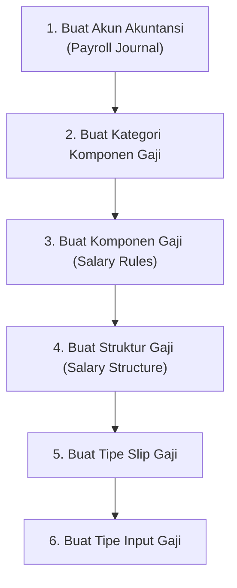

# Konfigurasi Data Master

Sebelum sistem dapat digunakan untuk operasional sehari-hari, implementor perlu menyiapkan data-data master (referensi) berikut ini. Semua konfigurasi ini cukup dilakukan **satu kali** di awal, kecuali ada perubahan kebutuhan bisnis.

---

## Urutan Konfigurasi

---

## 1. Jurnal Akuntansi Penggajian

Sistem akan membuat jurnal akuntansi secara otomatis ketika slip gaji dikonfirmasi. Untuk itu, perlu dikonfigurasi **jurnal khusus penggajian**.

**Menu:** `Akuntansi > Konfigurasi > Jurnal`

!!! example "Contoh Konfigurasi Jurnal"
    | Field | Nilai |
    |---|---|
    | Nama | `Jurnal Penggajian` |
    | Tipe | `Umum (Miscellaneous)` |
    | Kode | `PAYROLL` |

---

## 2. Kategori Komponen Gaji

Kategori digunakan untuk mengelompokkan komponen gaji saat ditampilkan di slip gaji.

**Menu:** `Penggajian > Konfigurasi > Kategori Komponen Gaji`

Buat kategori berikut (sesuaikan dengan kebutuhan):

| Nama Kategori | Kode | Keterangan |
|---|---|---|
| Penghasilan Kotor | `GROSS` | Semua komponen pendapatan |
| Potongan | `DED` | Semua potongan karyawan |
| Iuran Perusahaan | `EMP_CONT` | Kontribusi yang ditanggung perusahaan |
| Gaji Bersih | `NET` | Hasil akhir yang diterima karyawan |

---

## 3. Komponen Gaji (Salary Rules)

Ini adalah konfigurasi terbesar dan terpenting. Setiap elemen gaji dikonfigurasi sebagai satu **komponen gaji**.

**Menu:** `Penggajian > Konfigurasi > Komponen Gaji`

### Komponen Wajib yang Harus Dibuat

#### Gaji Pokok

| Field | Nilai |
|---|---|
| Nama | `Gaji Pokok` |
| Kode | `BASIC` |
| Kategori | `Penghasilan Kotor` |
| Urutan (Sequence) | `10` |
| Tampilkan di Slip | Ya |
| Cara Hitung | Dari input karyawan / perjanjian gaji |

#### BPJS Kesehatan — Bagian Karyawan

| Field | Nilai |
|---|---|
| Nama | `BPJS Kesehatan Karyawan` |
| Kode | `BPJS_KES_EE` |
| Kategori | `Potongan` |
| Urutan | `100` |
| Tampilkan di Slip | Ya |
| Cara Hitung | `1% × Gaji Pokok` |

#### BPJS Kesehatan — Bagian Perusahaan

| Field | Nilai |
|---|---|
| Nama | `BPJS Kesehatan Perusahaan` |
| Kode | `BPJS_KES_ER` |
| Kategori | `Iuran Perusahaan` |
| Urutan | `110` |
| Tampilkan di Slip | Opsional |
| Cara Hitung | `4% × Gaji Pokok` |

#### BPJS TK — JHT Karyawan

| Field | Nilai |
|---|---|
| Nama | `BPJS TK JHT Karyawan` |
| Kode | `BPJS_TK_JHT_EE` |
| Kategori | `Potongan` |
| Urutan | `120` |
| Cara Hitung | `2% × Gaji Pokok` |

#### Gaji Bersih (Net)

| Field | Nilai |
|---|---|
| Nama | `Gaji Bersih` |
| Kode | `NET` |
| Kategori | `Gaji Bersih` |
| Urutan | `999` |
| Cara Hitung | `Total Penghasilan − Total Potongan` |

!!! info "Komponen Tambahan"
    Selain komponen di atas, buat juga komponen lain sesuai kebutuhan klien, seperti:
    
    - Tunjangan Transportasi
    - Tunjangan Makan
    - Tunjangan Jabatan
    - Lembur
    - Potongan Absensi
    - dan seterusnya

---

## 4. Struktur Gaji (Salary Structure)

**Menu:** `Penggajian > Konfigurasi > Struktur Gaji`

### Strategi Pembuatan Struktur Gaji

Buat struktur dengan pola hierarki:

**Langkah 4.1 — Buat Struktur Induk**

| Field | Nilai |
|---|---|
| Nama | `Struktur Gaji Dasar Outsource` |
| Induk (Parent) | (kosong) |
| Komponen | Gaji Pokok, BPJS Kesehatan, BPJS TK, Gaji Bersih |

**Langkah 4.2 — Buat Struktur per Jenis Pekerjaan**

| Field | Nilai |
|---|---|
| Nama | `Gaji Operator Produksi` |
| Induk | `Struktur Gaji Dasar Outsource` |
| Komponen Tambahan | Tunjangan Transportasi, Tunjangan Makan |

| Field | Nilai |
|---|---|
| Nama | `Gaji Staf Administrasi` |
| Induk | `Struktur Gaji Dasar Outsource` |
| Komponen Tambahan | Tunjangan Komunikasi, Tunjangan Jabatan |

---

## 5. Tipe Slip Gaji

Tipe slip gaji menghubungkan slip gaji dengan jurnal akuntansi yang tepat.

**Menu:** `Penggajian > Konfigurasi > Tipe Slip Gaji`

!!! example "Contoh Tipe Slip Gaji"
    | Field | Nilai |
    |---|---|
    | Nama | `Slip Gaji Bulanan` |
    | Jurnal | `Jurnal Penggajian` |

---

## 6. Tipe Input Gaji

Input gaji adalah nilai variabel yang bisa berbeda per karyawan atau per periode. Buat tipe input untuk setiap jenis nilai variabel yang dibutuhkan.

**Menu:** `Penggajian > Konfigurasi > Tipe Input`

!!! example "Contoh Tipe Input"

    | Nama | Kode | Keterangan |
    |---|---|---|
    | `Gaji Pokok` | `BASIC_INPUT` | Nilai gaji pokok per karyawan |
    | `Tunjangan Transportasi` | `TRANS_INPUT` | Nominal tunjangan transportasi |
    | `Lembur` | `OVERTIME_INPUT` | Biaya lembur bulan ini |
    | `Bonus` | `BONUS` | Bonus yang diberikan bulan ini |
    | `Potongan Tidak Hadir` | `ABSENT_DED` | Potongan akibat absensi |

---

## Checklist Konfigurasi Data Master

Gunakan checklist ini untuk memastikan semua konfigurasi sudah selesai:

- [ ] Jurnal akuntansi penggajian sudah dibuat
- [ ] Akun-akun akuntansi sudah dikonfigurasi di setiap komponen gaji
- [ ] Kategori komponen gaji sudah dibuat (minimal: Gross, Potongan, Net)
- [ ] Semua komponen gaji sudah dibuat dengan rumus yang benar
- [ ] Struktur gaji induk sudah dibuat
- [ ] Struktur gaji per jenis pekerjaan sudah dibuat
- [ ] Tipe slip gaji sudah dibuat
- [ ] Tipe input gaji sudah dibuat
- [ ] Telah diuji coba dengan satu karyawan tes

!!! warning "Penting: Uji Coba Sebelum Go-Live"
    Sebelum sistem digunakan untuk penggajian nyata, selalu lakukan **uji coba** dengan membuat slip gaji untuk satu karyawan tes. Verifikasi bahwa semua komponen terhitung dengan benar dan entri akuntansi yang dihasilkan sudah sesuai dengan harapan tim keuangan.
