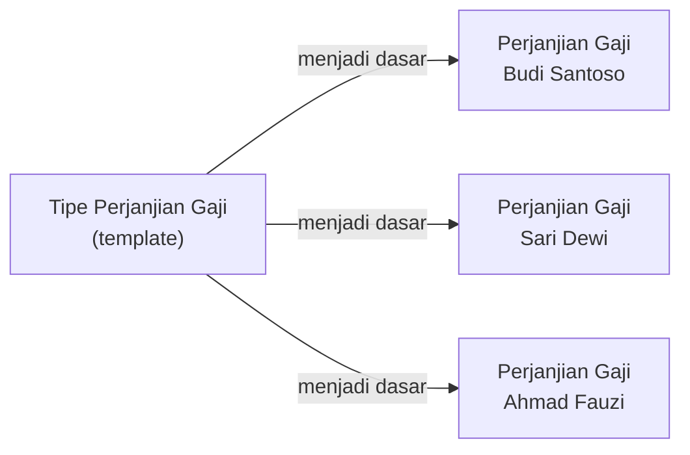

# Konfigurasi Tipe Perjanjian Gaji

**Tipe Perjanjian Gaji** menentukan template/acuan untuk setiap perjanjian gaji yang akan dibuat. Dengan tipe yang berbeda-beda, Anda bisa memiliki pola perjanjian gaji yang berbeda untuk kelompok karyawan yang berbeda.

---

## Konsep Tipe Perjanjian Gaji

Tipe Perjanjian Gaji berfungsi sebagai **template** yang memberikan nilai default ketika membuat perjanjian gaji baru. Ini memudahkan pembuatan perjanjian yang konsisten dan mengurangi kesalahan input.

---

## Data yang Dikonfigurasi di Tipe Perjanjian

| Field | Keterangan |
|---|---|
| **Nama** | Nama tipe perjanjian, tampil saat membuat perjanjian baru |
| **Urutan Penomoran** | Format nomor dokumen perjanjian yang digenerate otomatis |

---

## Langkah Membuat Tipe Perjanjian Gaji

**Menu:** `Penggajian > Konfigurasi > Tipe Perjanjian Gaji`

### Contoh: Tipe untuk Karyawan Outsource Standar

| Field | Nilai |
|---|---|
| **Nama** | `Perjanjian Kerja Outsource Standar` |
| **Urutan Nomor** | `PA/%(year)s/%(month)s/%(seq)s` |

### Contoh: Tipe untuk Karyawan Level Senior

| Field | Nilai |
|---|---|
| **Nama** | `Perjanjian Kerja Outsource Senior` |
| **Urutan Nomor** | `PA-SR/%(year)s/%(month)s/%(seq)s` |

---

## Konfigurasi Urutan Penomoran (Sequence)

Nomor dokumen perjanjian dihasilkan secara otomatis menggunakan **sequence** (urutan penomoran). Sequence perlu dikonfigurasi terpisah.

**Menu:** `Pengaturan > Teknis > Sequence & ID > Sequence`

!!! example "Contoh Format Nomor"
    Format: `PA/2025/01/0001`
    
    - `PA` = prefix untuk Payroll Agreement
    - `2025` = tahun
    - `01` = bulan
    - `0001` = nomor urut 4 digit, reset setiap bulan

---

## Rekomendasi Pengelompokan Tipe Perjanjian

Buat tipe perjanjian berdasarkan **perbedaan aturan bisnis** yang signifikan, bukan hanya perbedaan nilai gaji:

| Tipe | Digunakan Untuk |
|---|---|
| `Perjanjian Outsource Standar` | Karyawan umum, gaji sesuai UMR area |
| `Perjanjian Outsource Terampil` | Karyawan dengan keahlian khusus, gaji di atas UMR |
| `Perjanjian Outsource Senior` | Karyawan senior/supervisor, paket remunerasi berbeda |

!!! tip "Jangan Terlalu Banyak Tipe"
    Hindari membuat terlalu banyak tipe perjanjian. Jika perbedaannya hanya pada nilai gaji saja (bukan pada komponen atau aturan gaji), cukup gunakan satu tipe dan bedakan nilainya di input perjanjian per karyawan.

---

## Checklist Konfigurasi Tipe Perjanjian

- [ ] Minimal satu tipe perjanjian sudah dibuat
- [ ] Format penomoran sudah didiskusikan dengan tim HR/manajemen
- [ ] Sequence penomoran sudah dikonfigurasi dengan benar
- [ ] Uji coba membuat perjanjian gaji dengan tipe yang baru dibuat
