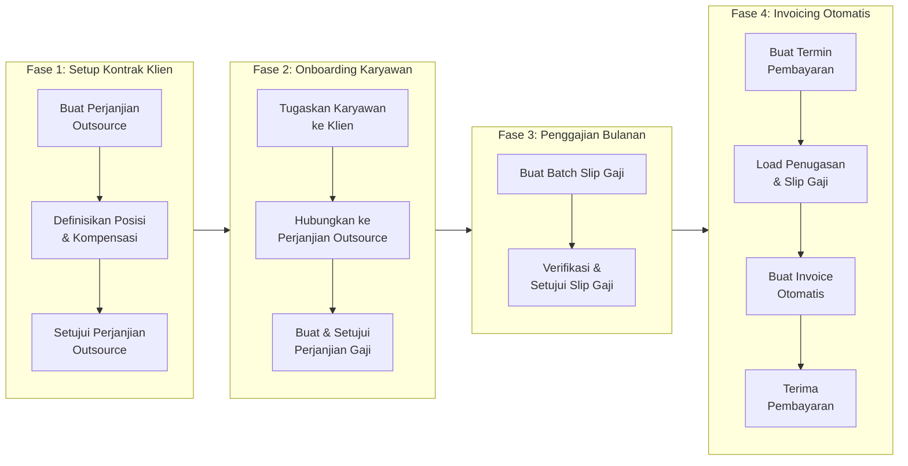
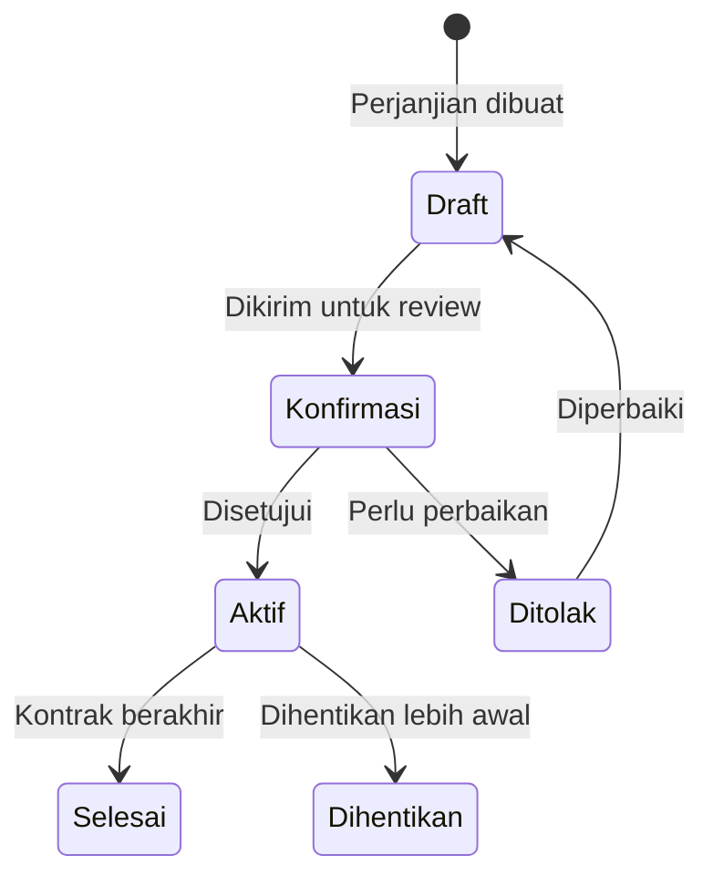
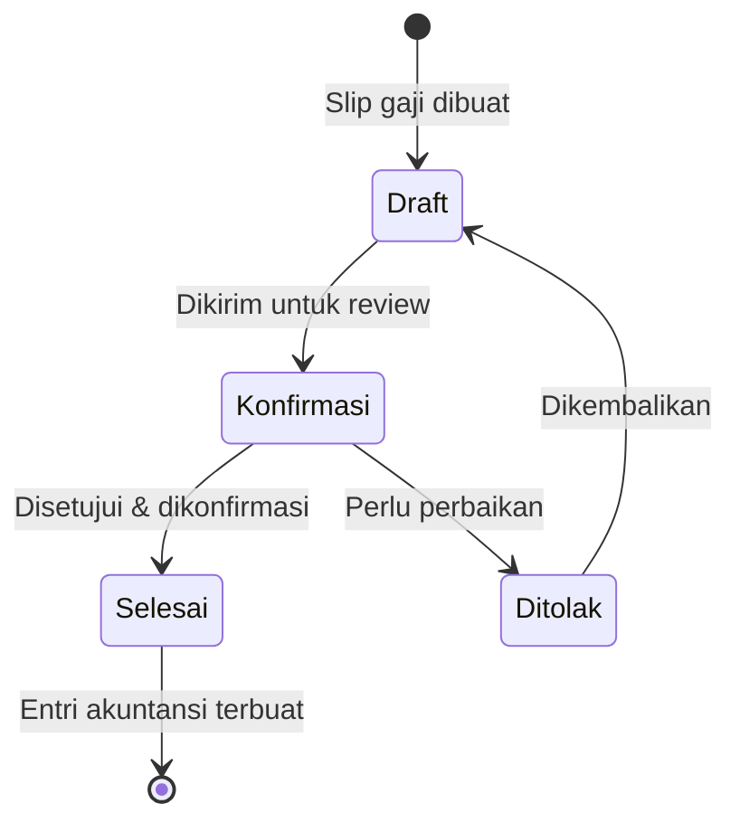
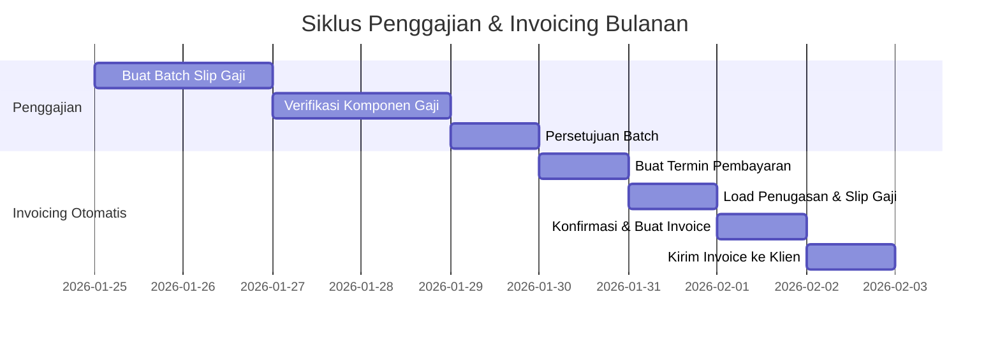

# Alur Bisnis End-to-End

Halaman ini menggambarkan keseluruhan alur bisnis pengelolaan penggajian karyawan outsource, mulai dari negosiasi kontrak dengan klien hingga klien membayar tagihan.

---

## Gambaran Besar

Alur bisnis dibagi menjadi empat fase utama:

---

## Fase 1: Setup Kontrak dengan Klien

Sebelum menempatkan karyawan, vendor dan klien menyepakati **kontrak outsourcing** secara resmi di sistem. Dokumen ini juga menjadi dasar pembuatan invoice kelak.

### Langkah 1.1 — Buat Perjanjian Outsource

**Menu di Odoo:** `Human Resources > External Assignment > Agreements`

Dokumen **Perjanjian Outsource** (`employee_external_assignment_agreement`) adalah kontrak antara vendor dengan klien. Isinya mencakup:

- Klien dan lokasi kerja
- Posisi pekerjaan yang disediakan beserta kuota jumlah karyawan
- Rentang kompensasi per komponen gaji untuk setiap posisi
- Konfigurasi jurnal dan akun akuntansi untuk penagihan

!!! example "Contoh"
    **PT. Maju Bersama** membuat perjanjian dengan **PT. Karya Utama**:

    - Tipe Perjanjian: `Outsourcing Operator Produksi`
    - Klien: `PT. Karya Utama`
    - Posisi: Operator Produksi — kuota 5 orang, Gaji Pokok min Rp 4.000.000

### Langkah 1.2 — Setujui Perjanjian Outsource

Setelah **Aktif (Open)**, perjanjian siap digunakan sebagai payung bagi penugasan karyawan.

---

## Fase 2: Onboarding Karyawan

### Langkah 2.1 — Tugaskan Karyawan ke Klien

**Menu di Odoo:** `Human Resources > External Assignment > Assignments`

Saat membuat penugasan, hubungkan ke **Perjanjian Outsource** yang sudah aktif dengan klien tersebut.

!!! example "Contoh"
    **Budi Santoso** ditempatkan di **PT. Karya Utama** mulai 1 Januari 2025:

    - Tipe Penugasan: `Penugasan Operator - Klien Industri`
    - Karyawan: `Budi Santoso`
    - Klien: `PT. Karya Utama`
    - **Perjanjian Outsource:** `EEAA/2025/000001`
    - Tanggal Mulai: `01/01/2025`

Setelah disetujui, status berubah menjadi **Aktif (Open)**.

---

### Langkah 2.2 — Buat Perjanjian Gaji Karyawan

**Menu di Odoo:** `Penggajian > Perjanjian Penggajian`

Ini adalah kesepakatan gaji antara vendor dan **karyawan** (bukan klien).

!!! warning "Dua Jenis Perjanjian yang Berbeda"
    | Jenis | Antara | Tujuan |
    |---|---|---|
    | **Perjanjian Outsource** | Vendor ↔ Klien | Dasar kontrak & penagihan ke klien |
    | **Perjanjian Gaji** | Vendor ↔ Karyawan | Dasar perhitungan gaji karyawan |

!!! example "Contoh"
    Untuk **Budi Santoso**:

    - Tipe Perjanjian: `Perjanjian Kerja Outsource Standar`
    - Karyawan: `Budi Santoso`
    - Struktur Gaji: `Gaji Operator Produksi`
    - Input: Gaji Pokok = Rp 4.000.000, Tunjangan Transportasi = Rp 500.000

Setelah disetujui dan **Aktif**, perjanjian ini menjadi dasar perhitungan gaji tiap bulan.

---

## Fase 3: Penggajian Bulanan

Setiap bulan, proses penggajian dilakukan untuk semua karyawan yang aktif.

### Langkah 3.1 — Buat Batch Slip Gaji

**Menu:** `Penggajian > Batch Slip Gaji`

Rekomendasinya: buat **satu batch per klien** agar data lebih terkelompok saat invoicing.

!!! example "Contoh"
    - `Gaji Januari 2025 - PT. Karya Utama` → Budi Santoso, Sari Dewi, Ahmad Fauzi
    - `Gaji Januari 2025 - PT. Nusantara Jaya` → karyawan di klien tersebut

### Langkah 3.2 — Setujui Slip Gaji

Setelah batch disetujui, semua slip gaji berstatus **Selesai (Done)** dan jurnal akuntansi biaya gaji terbuat otomatis.

---

## Fase 4: Invoicing Otomatis ke Klien

Proses invoicing **tidak dilakukan manual**. Sistem membaca data slip gaji yang sudah selesai dan menghasilkan invoice secara otomatis melalui **Termin Pembayaran (Payment Term)**.

### Langkah 4.1 — Buat Termin Pembayaran

**Menu:** `Human Resources > External Assignment > Payment Terms`

Atau dari form Perjanjian Outsource, klik **Tambah Payment Term**.

| Field | Nilai |
|---|---|
| Perjanjian Outsource | Pilih perjanjian yang berlaku dengan klien |
| Tanggal Mulai Periode | `01/01/2025` |
| Tanggal Selesai Periode | `31/01/2025` |

### Langkah 4.2 — Load Data Secara Otomatis

Klik tombol secara berurutan di form Termin Pembayaran:

1. **Load Penugasan** — menemukan semua karyawan aktif di klien ini selama periode
2. **Load Slip Gaji** — membaca slip gaji semua karyawan yang ditemukan
3. **Load Baris Slip Gaji** — memuat komponen gaji per aturan, siap ditagihkan

### Langkah 4.3 — Buat Invoice Otomatis

Klik **Buat Invoice**. Sistem otomatis membuat invoice kepada klien berdasarkan data slip gaji yang dimuat — dengan baris invoice per komponen gaji.

!!! example "Contoh Invoice yang Dihasilkan"
    | Baris Invoice | Nilai |
    |---|---|
    | Biaya Gaji Pokok — Januari 2025 | Rp 12.000.000 |
    | Biaya Tunjangan — Januari 2025 | Rp 3.900.000 |
    | Iuran BPJS Perusahaan — Januari 2025 | Rp 1.165.000 |

### Langkah 4.4 — Kirim Invoice dan Terima Pembayaran

1. Klik **Lihat Invoice** dari termin pembayaran
2. Konfirmasi, kirim ke klien
3. Catat pembayaran saat klien melunasi

---

## Ringkasan Timeline Bulanan

---

!!! warning "Penting: Urutan yang Benar"
    Invoice hanya bisa dibuat jika semua slip gaji karyawan yang bersangkutan sudah dalam status **Selesai (Done)**. Pastikan batch penggajian selesai lebih dahulu sebelum membuat termin pembayaran.

---
