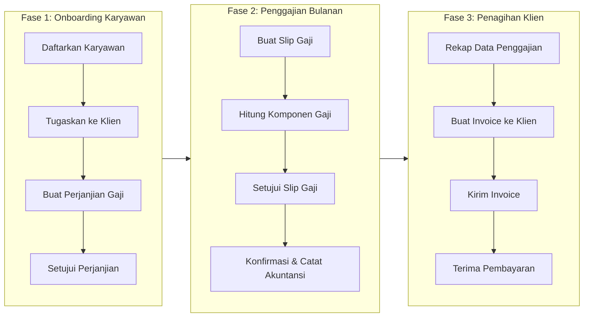
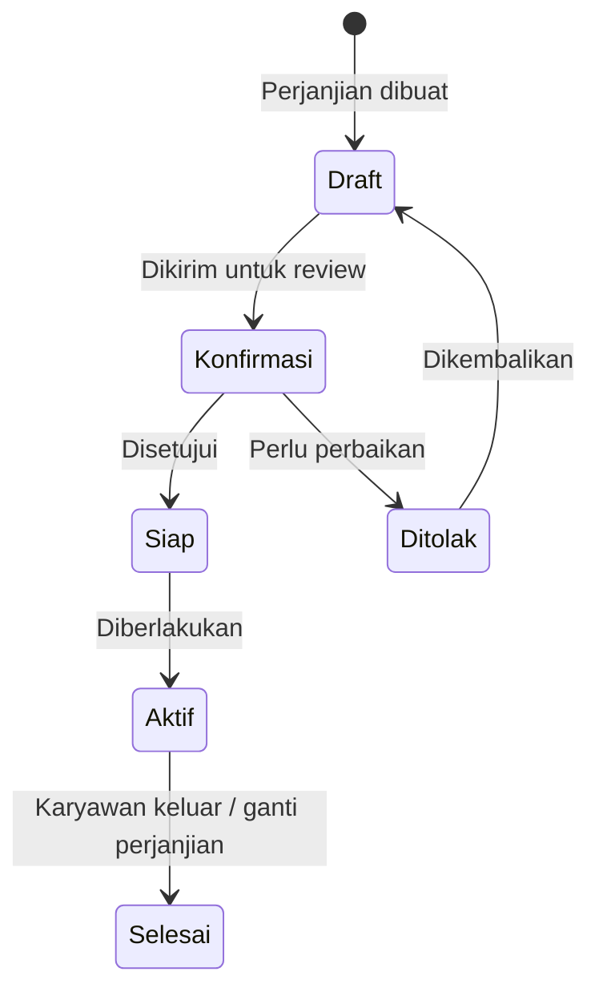
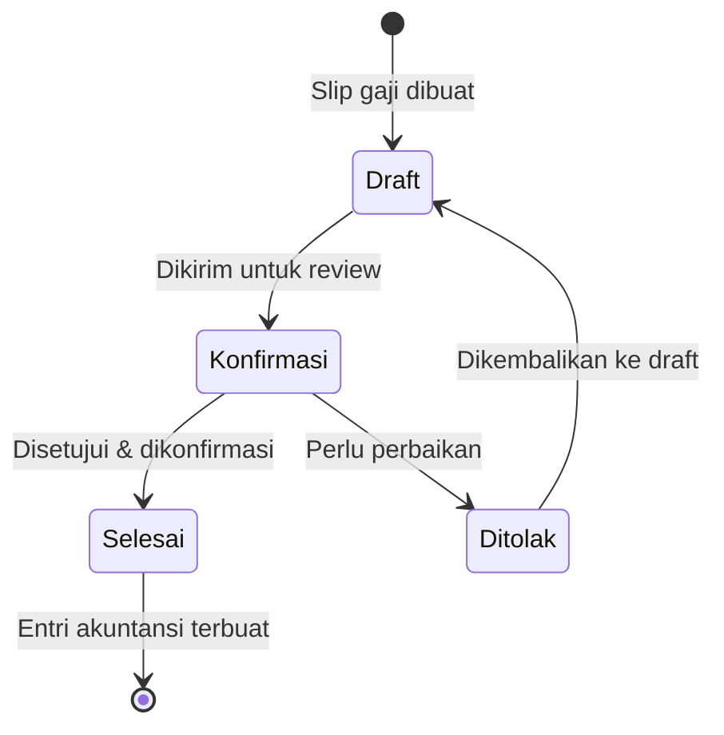
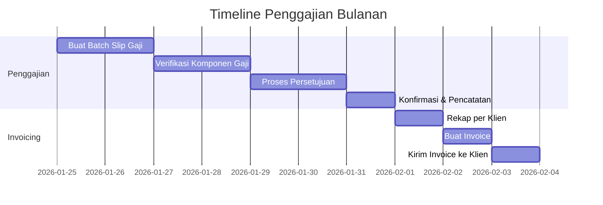

# Alur Bisnis End-to-End

Halaman ini menggambarkan keseluruhan alur bisnis pengelolaan penggajian karyawan outsource, mulai dari karyawan pertama kali bergabung hingga klien membayar tagihan.

---

## Gambaran Besar

Alur bisnis dibagi menjadi tiga fase utama:

---

## Fase 1: Onboarding Karyawan

### Langkah 1.1 — Daftarkan Karyawan

Setiap karyawan harus terdaftar sebagai **karyawan (employee)** di Odoo sebelum bisa diproses penggajiannya.

**Siapa yang melakukan:** Tim HR / Admin  
**Menu di Odoo:** `Pegawai > Pegawai`

Data yang wajib diisi:
- Nama lengkap
- Nomor identitas (KTP)
- Data kepegawaian (jabatan, departemen)

---

### Langkah 1.2 — Tugaskan Karyawan ke Klien

Setelah karyawan terdaftar, buat dokumen **Penugasan Eksternal** untuk mencatat ke klien mana karyawan ini ditempatkan.

**Menu di Odoo:** `Pegawai > Penugasan Eksternal`

!!! example "Contoh"
    **Budi Santoso** baru bergabung sebagai karyawan PT. Maju Bersama dan akan ditempatkan di **PT. Karya Utama** sebagai operator produksi mulai **1 Januari 2025**.

    - Tipe Penugasan: `Operasional - Klien Industri`
    - Karyawan: `Budi Santoso`
    - Klien: `PT. Karya Utama`
    - Tanggal Mulai: `01/01/2025`

Setelah penugasan disetujui, status berubah menjadi **Open (Aktif)**.

---

### Langkah 1.3 — Buat Perjanjian Gaji

Buat dokumen **Perjanjian Penggajian** yang mendefinisikan skema gaji karyawan tersebut.

**Menu di Odoo:** `Penggajian > Perjanjian Penggajian`

!!! example "Contoh"
    Untuk **Budi Santoso** yang telah ditugaskan ke PT. Karya Utama:

    - Tipe Perjanjian: `Perjanjian Kerja Outsource Standar`
    - Karyawan: `Budi Santoso`
    - Struktur Gaji: `Gaji Operator Produksi`
    - Input Khusus: Tunjangan Transportasi = Rp 500.000

---

### Langkah 1.4 — Setujui Perjanjian Gaji

Perjanjian gaji melewati alur persetujuan:

Setelah status **Aktif (Open)**, sistem secara otomatis menetapkan perjanjian ini sebagai dasar perhitungan gaji karyawan.

---

## Fase 2: Penggajian Bulanan

Setiap bulan, proses penggajian dilakukan untuk semua karyawan yang aktif.

### Langkah 2.1 — Buat Slip Gaji

Ada dua cara membuat slip gaji:

=== "Individual (satu per satu)"

    **Menu:** `Penggajian > Slip Gaji`

    Cocok untuk perusahaan dengan sedikit karyawan atau koreksi individual.
    
    !!! example "Contoh"
        Buat slip gaji untuk **Budi Santoso** periode **Januari 2025**:
        
        - Tipe Slip Gaji: `Slip Gaji Bulanan`
        - Karyawan: `Budi Santoso`
        - Periode: `01/01/2025 – 31/01/2025`
        - Tanggal Akuntansi: `31/01/2025`

=== "Batch (massal)"

    **Menu:** `Penggajian > Batch Slip Gaji`

    Cocok untuk perusahaan dengan banyak karyawan. Satu batch bisa memproses puluhan karyawan sekaligus.
    
    !!! example "Contoh"
        Buat batch gaji untuk **bulan Januari 2025**:
        
        - Nama Batch: `Gaji Januari 2025`
        - Tipe Slip Gaji: `Slip Gaji Bulanan`
        - Periode: `01/01/2025 – 31/01/2025`
        - Karyawan: pilih semua karyawan aktif

---

### Langkah 2.2 — Verifikasi Komponen Gaji

Setelah slip gaji dibuat, sistem secara otomatis menghitung komponen gaji berdasarkan:

- **Struktur gaji** yang terdefinisi di perjanjian karyawan
- **Komponen gaji (rules)** yang aktif dalam struktur tersebut
- **Input khusus** yang sudah dikonfigurasi di perjanjian gaji

Implementor perlu memverifikasi bahwa semua komponen terhitung dengan benar sebelum meneruskan ke persetujuan.

---

### Langkah 2.3 — Setujui dan Konfirmasi Slip Gaji

Slip gaji melewati alur berikut:

Ketika status berubah menjadi **Selesai (Done)**, sistem otomatis membuat **jurnal akuntansi** untuk biaya gaji.

---

## Fase 3: Penagihan Klien

Setelah penggajian selesai, vendor perlu menagih klien sesuai biaya tenaga kerja yang telah dikeluarkan.

### Langkah 3.1 — Rekap Penggajian per Klien

Sebelum membuat invoice, rekap data gaji karyawan berdasarkan penugasan:

- Karyawan mana yang bekerja di klien tertentu bulan ini
- Berapa total biaya gaji per karyawan
- Apakah ada biaya tambahan (lembur, tunjangan khusus, dll.)

!!! example "Contoh Rekap Januari 2025 — PT. Karya Utama"

    | Karyawan | Gaji Pokok | Tunjangan | Total Gaji |
    |---|---|---|---|
    | Budi Santoso | Rp 4.000.000 | Rp 500.000 | Rp 4.500.000 |
    | Sari Dewi | Rp 3.800.000 | Rp 400.000 | Rp 4.200.000 |
    | **Total** | **Rp 7.800.000** | **Rp 900.000** | **Rp 8.700.000** |

---

### Langkah 3.2 — Buat Invoice ke Klien

**Menu di Odoo:** `Akuntansi > Pelanggan > Invoice`

Invoice dibuat secara manual dengan mengacu pada data penggajian yang sudah diproses.

!!! example "Contoh Invoice ke PT. Karya Utama"

    **Invoice No.:** INV/2025/01/0001  
    **Tanggal:** 31 Januari 2025  
    **Pelanggan:** PT. Karya Utama  

    | Deskripsi | Qty | Harga | Subtotal |
    |---|---|---|---|
    | Jasa Tenaga Kerja Outsource – Januari 2025 | 2 orang | Rp 4.750.000 | Rp 9.500.000 |

    > *Catatan: Harga per orang = Total gaji + Margin vendor*

---

### Langkah 3.3 — Kirim Invoice dan Terima Pembayaran

Setelah invoice dikonfirmasi di Odoo:

1. Kirim invoice ke klien (email atau cetak)
2. Pantau status pembayaran di menu Akuntansi
3. Rekam pembayaran ketika klien melunasi tagihan

---

## Ringkasan Timeline Bulanan

---

!!! warning "Penting: Urutan yang Benar"
    Pastikan Perjanjian Gaji karyawan sudah dalam status **Aktif (Open)** sebelum membuat slip gaji. Jika perjanjian belum aktif, sistem tidak akan bisa menentukan struktur gaji yang digunakan.
