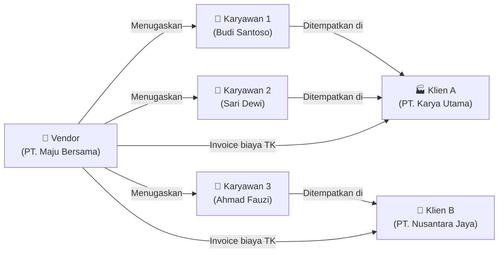
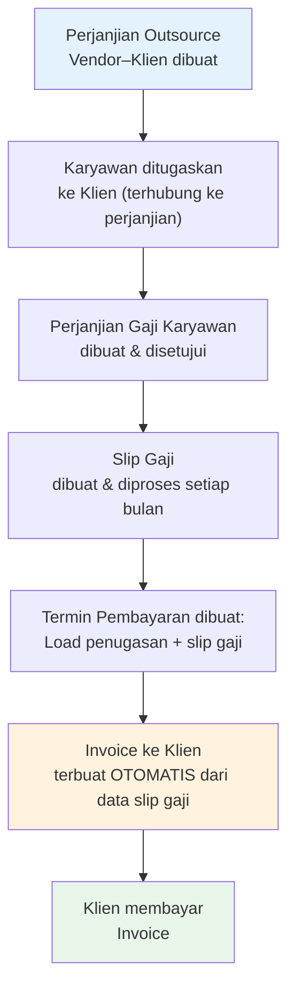

# Gambaran Umum Sistem

## Konteks Bisnis

Perusahaan penyedia jasa outsourcing (disebut **vendor**) mengelola karyawan yang ditempatkan di berbagai perusahaan klien. Vendor bertanggung jawab atas:

- Penggajian karyawan setiap bulan
- Pencatatan penempatan (penugasan) karyawan di klien
- Penagihan biaya tenaga kerja kepada klien

Sistem Odoo yang dikonfigurasi dengan modul SSI memungkinkan seluruh proses ini berjalan terintegrasi dalam satu platform.

---

## Pihak-Pihak yang Terlibat

| Pihak | Peran dalam Sistem |
|---|---|
| **Vendor** | Pengguna utama sistem Odoo. Mengelola karyawan, penugasan, penggajian, dan invoicing. |
| **Karyawan** | Tercatat sebagai karyawan vendor, ditempatkan di klien. Menerima gaji dari vendor. |
| **Klien** | Tercatat sebagai mitra (partner) di Odoo. Menerima invoice dari vendor. |

---

## Modul dan Fungsinya

### 1. Perjanjian Outsource Vendor–Klien (`ssi_employee_external_assignment_agreement`)

Modul ini adalah **inti dari hubungan bisnis vendor dengan klien**. Setiap klien yang menggunakan jasa outsourcing vendor harus memiliki dokumen perjanjian ini.

Informasi yang dicatat meliputi:
- Klien dan lokasi kerja
- Posisi pekerjaan yang disediakan beserta kuota jumlah karyawan
- Rentang kompensasi (minimum–maksimum) per komponen gaji untuk setiap posisi
- Akun dan jurnal akuntansi untuk penagihan (invoicing)
- Termin pembayaran (billing period) yang menjadi dasar pembuatan invoice

Ketika periode penagihan tiba, modul ini secara **otomatis membaca data slip gaji** karyawan yang ditugaskan di klien tersebut, menghitung total biaya per komponen, dan menghasilkan **invoice kepada klien** tanpa perlu input manual.

### 2. Penugasan Karyawan Eksternal (`ssi_employee_external_assignment`)

Modul ini mencatat di mana seorang karyawan sedang ditempatkan. Setiap karyawan hanya boleh memiliki **satu penugasan aktif** pada satu waktu. Setiap penugasan wajib terhubung ke **Perjanjian Outsource** yang berlaku antara vendor dan klien.

Informasi yang dicatat meliputi:
- Karyawan yang ditugaskan
- Klien dan perjanjian outsource yang menaungi
- Tanggal mulai dan selesai penugasan
- Lokasi spesifik (jika klien memiliki beberapa lokasi)

### 3. Perjanjian Penggajian Karyawan (`ssi_payroll_agreement`)

Modul ini mencatat kesepakatan gaji antara vendor dan **karyawan**. Setiap karyawan hanya boleh memiliki **satu perjanjian gaji aktif** pada satu waktu.

Informasi yang dicatat meliputi:
- Struktur gaji yang berlaku untuk karyawan ini
- Komponen gaji yang disepakati
- Input/nilai khusus (misal: tunjangan tetap tertentu)

### 4. Slip Gaji (`ssi_hr_payroll`)

Modul ini memproses penggajian karyawan setiap periode. Sistem secara otomatis menghitung total gaji berdasarkan struktur gaji dan komponen yang telah dikonfigurasi.

Proses meliputi:
- Pembuatan slip gaji per karyawan
- Perhitungan otomatis komponen gaji
- Persetujuan dan pengesahan slip gaji
- Pencatatan akuntansi

### 5. Batch Gaji (`ssi_hr_payroll_batch`)

Ekstensi dari modul slip gaji yang memungkinkan pemrosesan gaji untuk banyak karyawan sekaligus dalam satu siklus persetujuan.

---

## Alur Data Antar Modul

---

## Prinsip Kerja Sistem

### Status Dokumen

Semua dokumen dalam sistem mengikuti pola **status yang seragam**:

| Status | Keterangan |
|---|---|
| **Draft** | Dokumen baru dibuat, masih bisa diedit bebas |
| **Konfirmasi** | Dokumen dikirim untuk disetujui, tidak bisa diedit sembarangan |
| **Disetujui / Open** | Dokumen aktif dan berlaku |
| **Selesai / Done** | Dokumen selesai diproses |
| **Dibatalkan** | Dokumen dibatalkan |
| **Ditolak** | Dokumen dikembalikan untuk diperbaiki |

### Alur Persetujuan

Setiap dokumen penting memiliki alur persetujuan (approval flow). Ini memastikan:

- Tidak ada perubahan yang tidak sah
- Ada jejak audit yang jelas
- Setiap tindakan dapat dilacak siapa yang melakukannya

### Penomoran Dokumen Otomatis

Nomor dokumen (seperti nomor slip gaji, nomor perjanjian) digenerate otomatis oleh sistem ketika dokumen mencapai status tertentu. Implementor perlu mengkonfigurasi **sequence** (urutan penomoran) untuk setiap jenis dokumen.

---

!!! note "Catatan untuk Implementor"
    Sebelum memulai konfigurasi, pastikan modul-modul berikut sudah terinstall di Odoo:
    
    - `ssi_employee_external_assignment_agreement`
    - `ssi_employee_external_assignment`
    - `ssi_payroll_agreement`
    - `ssi_hr_payroll`
    - `ssi_hr_payroll_batch` (opsional, untuk proses massal)
    
    Instalasi modul adalah tanggung jawab tim teknis, bukan implementor.
