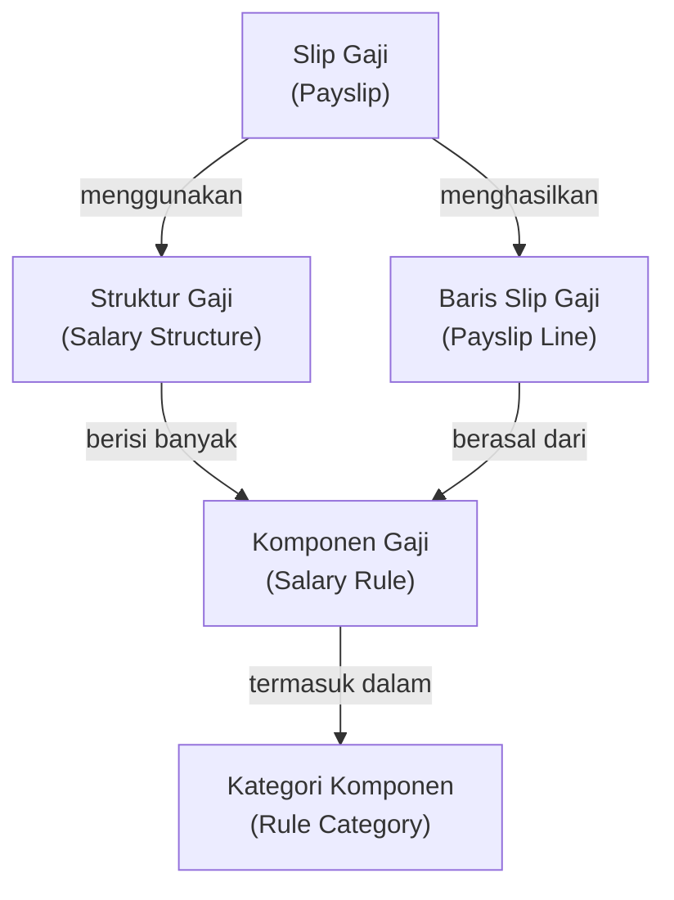
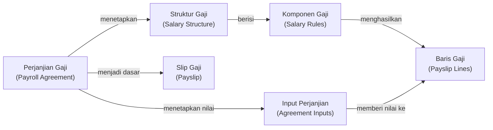

# Struktur dan Komponen Gaji

Memahami konsep struktur gaji adalah hal paling penting sebelum melakukan konfigurasi sistem penggajian. Halaman ini menjelaskan konsep-konsep tersebut secara non-teknis.

---

## Hierarki Konsep Penggajian



---

## Struktur Gaji (Salary Structure)

**Struktur gaji** adalah kumpulan komponen-komponen gaji yang berlaku untuk sekelompok karyawan dengan karakteristik yang sama.

Contoh nama struktur gaji yang umum digunakan:

| Nama Struktur | Digunakan untuk |
|---|---|
| `Gaji Operator Produksi` | Karyawan yang bekerja di lini produksi |
| `Gaji Staf Administrasi` | Karyawan yang bekerja di bagian administrasi |
| `Gaji Satpam` | Karyawan yang bertugas sebagai satuan pengamanan |
| `Gaji Cleaning Service` | Karyawan yang bertugas kebersihan |

### Hierarki Struktur Gaji

Struktur gaji dapat disusun secara hierarkis. Struktur anak (child) akan **mewarisi semua komponen** dari struktur induk (parent).

!!! example "Contoh Hierarki"
    ```
    Struktur Gaji Umum (Parent)
    ├── Gaji Pokok
    ├── BPJS Kesehatan
    └── BPJS Ketenagakerjaan

    Gaji Operator Produksi (Child dari "Gaji Umum")
    ├── (Mewarisi dari parent)
    ├── Tunjangan Transportasi
    └── Tunjangan Makan
    
    Gaji Staf Administrasi (Child dari "Gaji Umum")
    ├── (Mewarisi dari parent)
    └── Tunjangan Komunikasi
    ```

    Dengan hierarki ini, komponen `Gaji Pokok`, `BPJS Kesehatan`, dan `BPJS Ketenagakerjaan` hanya perlu dikonfigurasi satu kali di struktur induk, dan secara otomatis berlaku untuk semua struktur turunannya.

---

## Komponen Gaji (Salary Rule)

**Komponen gaji** adalah satu elemen gaji, bisa berupa penghasilan (positif) atau potongan (negatif).

### Kategori Komponen Gaji

Setiap komponen termasuk dalam satu kategori. Kategori digunakan untuk mengelompokkan komponen saat ditampilkan di slip gaji.

| Kategori | Contoh Komponen |
|---|---|
| **Penghasilan (Gross)** | Gaji Pokok, Tunjangan Jabatan, Tunjangan Transportasi |
| **Potongan** | Potongan Pinjaman, Potongan Ketidakhadiran |
| **Iuran Karyawan** | BPJS Kesehatan Karyawan (1%), BPJS TK Karyawan (2%) |
| **Iuran Perusahaan** | BPJS Kesehatan Perusahaan (4%), BPJS TK Perusahaan (3.7%) |
| **Bersih (Net)** | Total Gaji Bersih (hasil perhitungan akhir) |

### Cara Komponen Gaji Dihitung

Nilai setiap komponen gaji ditentukan dengan **rumus yang dikonfigurasi oleh implementor**. Ada beberapa cara umum:

=== "Nilai Tetap"

    Komponen dengan nilai yang sama setiap bulan untuk semua karyawan.  
    
    Contoh: `Tunjangan Makan = Rp 300.000`

=== "Persentase dari Gaji Pokok"

    Komponen yang dihitung berdasarkan persentase komponen lain.
    
    Contoh: `BPJS Kesehatan Karyawan = 1% × Gaji Pokok`

=== "Nilai dari Input Karyawan"

    Komponen yang nilainya berbeda-beda per karyawan, dikonfigurasi di perjanjian gaji.
    
    Contoh: `Tunjangan Transportasi = nilai yang disepakati di perjanjian`

=== "Hasil Perhitungan Kompleks"

    Komponen yang nilainya tergantung kondisi tertentu.
    
    Contoh: `Tunjangan Jabatan = hanya ada jika karyawan berstatus Supervisor`

---

## Input Gaji

**Input gaji** adalah nilai-nilai variabel yang perlu dimasukkan dan bisa berbeda untuk setiap karyawan atau setiap periode.

### Jenis Input

| Jenis | Dikonfigurasi di | Contoh |
|---|---|---|
| **Input Statis** | Profil Karyawan | Nominal tunjangan tetap per karyawan |
| **Input Perjanjian** | Perjanjian Gaji | Nilai yang disepakati saat perjanjian dibuat |
| **Input Slip Gaji** | Input manual saat buat slip | Bonus bulan ini, lembur, potongan tidak hadir |

---

## Contoh Slip Gaji Lengkap

Berikut contoh tampilan slip gaji yang dihasilkan sistem:

!!! example "Slip Gaji — Budi Santoso — Januari 2025"

    **Periode:** 1 – 31 Januari 2025  
    **Struktur Gaji:** Gaji Operator Produksi

    ---

    **PENGHASILAN**

    | Komponen | Jumlah |
    |---|---|
    | Gaji Pokok | Rp 4.000.000 |
    | Tunjangan Transportasi | Rp 500.000 |
    | Tunjangan Makan | Rp 300.000 |
    | **Total Penghasilan (Gross)** | **Rp 4.800.000** |

    ---

    **POTONGAN**

    | Komponen | Jumlah |
    |---|---|
    | BPJS Kesehatan (1%) | Rp 48.000 |
    | BPJS TK JHT (2%) | Rp 96.000 |
    | **Total Potongan** | **Rp 144.000** |

    ---

    **GAJI BERSIH: Rp 4.656.000**

---

## Hubungan antara Perjanjian Gaji dan Slip Gaji



Ketika slip gaji dibuat untuk karyawan yang memiliki perjanjian gaji aktif:

1. Sistem membaca **struktur gaji** dari perjanjian karyawan
2. Semua **komponen gaji** dalam struktur tersebut diambil
3. **Input perjanjian** digunakan sebagai nilai variabel dalam perhitungan
4. Semua komponen dihitung dan ditampilkan sebagai **baris slip gaji**

---

!!! tip "Tips untuk Implementor"
    Rancang hierarki struktur gaji dari komponen yang **paling umum** ke yang **paling spesifik**. Ini akan menghemat banyak waktu konfigurasi dan memudahkan pemeliharaan di kemudian hari.
    
    Misalnya:
    - Buat satu struktur induk `Gaji Dasar Outsource` yang berisi BPJS dan komponen wajib
    - Buat struktur turunan untuk setiap jenis pekerjaan/posisi
