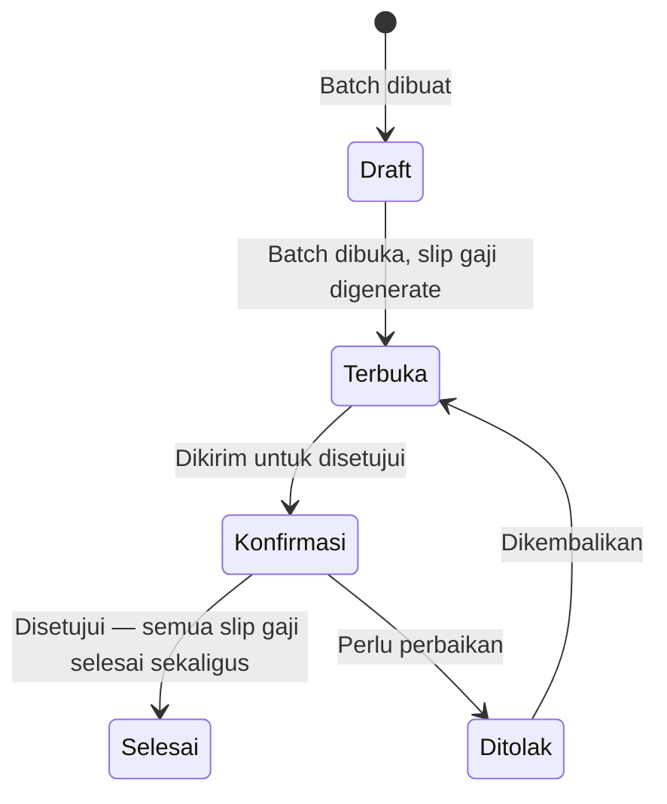

# Batch Pemrosesan Gaji Massal

Fitur **Batch Gaji** memungkinkan pembuatan dan pemrosesan slip gaji untuk **banyak karyawan sekaligus** dalam satu siklus persetujuan. Ini sangat efisien untuk perusahaan dengan 10 karyawan atau lebih.

---

## Kapan Menggunakan Batch vs Individual?

| Kondisi | Rekomendasi |
|---|---|
| Lebih dari 10 karyawan, gaji standar per periode | **Gunakan Batch** |
| Kurang dari 10 karyawan | Bisa Batch atau Individual |
| Ada koreksi khusus untuk 1 karyawan | **Individual** |
| Penggajian pertama kali (onboarding) | **Individual** untuk memverifikasi konfigurasi |

---

## Alur Batch Gaji

---

## Cara Membuat Batch Gaji

**Menu:** `Penggajian > Batch Slip Gaji > Baru`

### Langkah 1 — Isi Data Batch

| Field | Cara Mengisi |
|---|---|
| **Nama Batch** | Nama deskriptif, mis. `Gaji Bulanan - Januari 2025` |
| **Tipe Slip Gaji** | Pilih tipe yang sama untuk semua karyawan di batch ini |
| **Tanggal** | Tanggal pembuatan batch |
| **Tanggal Mulai Periode** | Awal periode penggajian |
| **Tanggal Selesai Periode** | Akhir periode penggajian |

!!! example "Contoh Pengisian"
    | Field | Nilai |
    |---|---|
    | Nama Batch | `Gaji Bulanan - Januari 2025` |
    | Tipe Slip Gaji | `Slip Gaji Bulanan` |
    | Tanggal | `31/01/2025` |
    | Tanggal Mulai Periode | `01/01/2025` |
    | Tanggal Selesai Periode | `31/01/2025` |

---

### Langkah 2 — Pilih Karyawan

Di tab **Karyawan**, pilih karyawan yang akan diproses dalam batch ini.

!!! tip "Filter Karyawan"
    Sistem menampilkan hanya karyawan yang sudah memiliki struktur gaji yang terkonfigurasi (baik dari perjanjian maupun manual). Karyawan tanpa struktur gaji tidak akan muncul.

Anda bisa:
- Klik **Tambah semua** untuk memasukkan semua karyawan yang tersedia
- Atau pilih karyawan satu per satu

!!! example "Contoh Pemilihan Karyawan"
    Untuk Batch Januari 2025, pilih semua karyawan aktif:
    - Budi Santoso
    - Sari Dewi
    - Ahmad Fauzi
    - (dan seterusnya)

---

### Langkah 3 — Buka Batch (Generate Slip Gaji)

Klik tombol **Buka Batch** (Open).

Sistem akan **otomatis membuat slip gaji individual** untuk setiap karyawan yang dipilih. Status batch berubah ke **Terbuka (Open)**.

Setelah ini, Anda bisa melihat semua slip gaji yang telah digenerate melalui tombol/tab **Slip Gaji** di form batch.

---

### Langkah 4 — Verifikasi Slip Gaji

!!! warning "Jangan Lewati Langkah Ini"
    Sebelum melanjutkan ke konfirmasi, **selalu verifikasi** beberapa slip gaji secara sampling (misalnya 10% dari total). Periksa:
    
    - Apakah komponen gaji terhitung dengan benar?
    - Apakah nilai gaji pokok sesuai perjanjian masing-masing karyawan?
    - Apakah ada karyawan yang slip gajinya tidak terbuat?

Untuk membuka slip gaji individual dari dalam batch:

1. Klik tab **Slip Gaji** di form batch
2. Klik baris karyawan yang ingin diperiksa

---

### Langkah 5 — Konfirmasi Batch

Setelah verifikasi selesai dan semua slip gaji sudah benar:

1. Klik tombol **Konfirmasi Batch**
2. Seluruh slip gaji akan masuk ke status **Konfirmasi** sekaligus

---

### Langkah 6 — Persetujuan dan Pengesahan

Manajer yang berwenang akan menyetujui batch:

1. Buka batch yang perlu disetujui
2. Klik **Setujui**
3. Status batch berubah ke **Selesai (Done)**
4. **Semua slip gaji dalam batch** otomatis berubah ke status **Selesai** sekaligus
5. Jurnal akuntansi untuk semua karyawan terbuat bersama-sama

---

## Menangani Pengecualian dalam Batch

Jika ada karyawan yang slip gajinya perlu diperbaiki setelah batch selesai:

1. **Jangan batalkan seluruh batch**
2. Buka slip gaji individual karyawan yang bermasalah
3. Proses pembatalan dan koreksi di level individual
4. Batch yang lain tetap valid

---

## Memantau Status Batch

Dari menu `Penggajian > Batch Slip Gaji`, Anda bisa melihat semua batch beserta statusnya.

| Status | Artinya |
|---|---|
| Draft | Batch baru dibuat, belum ada slip gaji |
| Terbuka | Slip gaji sudah digenerate, dalam verifikasi |
| Konfirmasi | Batch menunggu persetujuan |
| Selesai | Semua slip gaji sudah diproses |

---

!!! tip "Tips Efisiensi"
    Untuk perusahaan yang menugaskan karyawan ke beberapa klien berbeda, pertimbangkan membuat **satu batch per klien**. Ini memudahkan saat membuat invoice, karena data penggajian per klien sudah terkelompok.
    
    Contoh:
    - Batch `Gaji Januari 2025 - PT. Karya Utama` → berisi karyawan di PT. Karya Utama
    - Batch `Gaji Januari 2025 - PT. Nusantara Jaya` → berisi karyawan di PT. Nusantara Jaya
