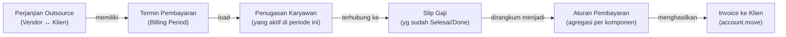
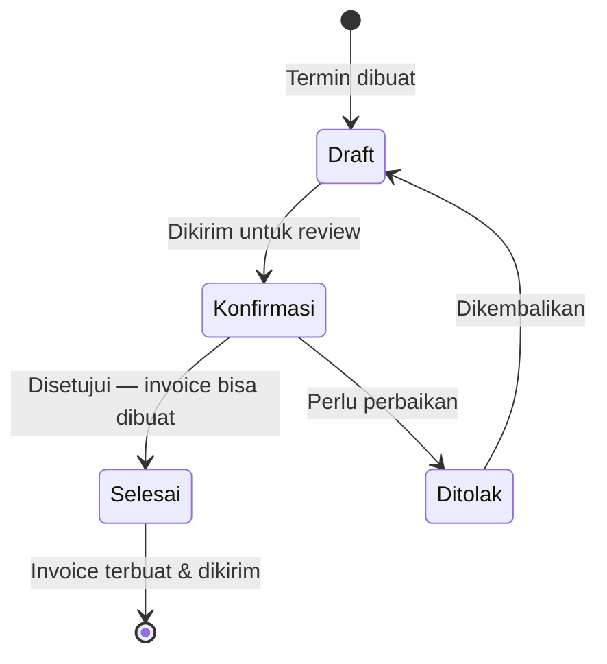

# Invoicing ke Klien

Invoice kepada klien dibuat secara **otomatis** oleh sistem berdasarkan data slip gaji karyawan yang sudah diproses. Mekanisme ini bekerja melalui dokumen **Termin Pembayaran (Payment Term)** yang menjadi bagian dari Perjanjian Outsource.

---

## Konsep: Termin Pembayaran

**Termin Pembayaran** adalah dokumen billing period — satu dokumen per klien per periode. Dokumen ini:

1. Membaca daftar karyawan yang aktif di klien selama periode tersebut
2. Mengambil slip gaji masing-masing karyawan
3. Mengagregasi nilai per komponen gaji
4. Menghasilkan invoice kepada klien secara otomatis

---

## Prasyarat

Sebelum membuat termin pembayaran, pastikan:

- [ ] **Perjanjian Outsource** dengan klien sudah dalam status **Aktif**
- [ ] Jurnal invoice dan akun piutang sudah dikonfigurasi di perjanjian
- [ ] Semua **slip gaji** karyawan di klien tersebut sudah dalam status **Selesai (Done)**
- [ ] Karyawan yang bersangkutan memiliki **penugasan aktif** yang terhubung ke perjanjian outsource

---

## Alur Termin Pembayaran

---

## Langkah-Langkah Membuat Invoice

### Langkah 1 — Buat Termin Pembayaran

**Cara 1:** Dari menu utama  
`Human Resources > External Assignment > Payment Terms > Baru`

**Cara 2:** Dari form Perjanjian Outsource  
Buka perjanjian yang bersangkutan → Tab **Termin Pembayaran** → klik **Tambah**

| Field | Cara Mengisi |
|---|---|
| **Perjanjian** | Pilih perjanjian outsource dengan klien |
| **Tanggal Mulai Periode** | Awal periode yang akan ditagihkan |
| **Tanggal Selesai Periode** | Akhir periode |

!!! example "Contoh Pengisian"
    | Field | Nilai |
    |---|---|
    | Perjanjian | `EEAA/2025/000001 — PT. Karya Utama` |
    | Tanggal Mulai Periode | `01/01/2025` |
    | Tanggal Selesai Periode | `31/01/2025` |

---

### Langkah 2 — Load Penugasan Aktif

Klik tombol **Load Penugasan** (Load External Assignments).

Sistem akan menelusuri semua penugasan karyawan yang:
- Terhubung ke perjanjian outsource yang dipilih
- Aktif selama rentang periode yang ditentukan

!!! example "Hasil Load Penugasan"
    Tab **Penugasan** akan terisi dengan:
    
    | Karyawan | Perjanjian | Tanggal Mulai Penugasan |
    |---|---|---|
    | Budi Santoso | EEAA/2025/000001 | 01/01/2025 |
    | Sari Dewi | EEAA/2025/000001 | 15/11/2024 |
    | Ahmad Fauzi | EEAA/2025/000001 | 01/01/2025 |

---

### Langkah 3 — Load Slip Gaji

Klik tombol **Load Slip Gaji** (Reload Payslip).

Sistem mencari slip gaji dari karyawan yang sudah di-load pada langkah sebelumnya, dengan kriteria:
- Status slip gaji: **Selesai (Done)**
- Periode slip gaji masuk dalam rentang periode termin pembayaran

!!! example "Hasil Load Slip Gaji"
    Tab **Slip Gaji** akan terisi:
    
    | Slip Gaji | Karyawan | Periode | Status |
    |---|---|---|---|
    | PSL/2025/01/0001 | Budi Santoso | Jan 2025 | Selesai ✓ |
    | PSL/2025/01/0002 | Sari Dewi | Jan 2025 | Selesai ✓ |
    | PSL/2025/01/0003 | Ahmad Fauzi | Jan 2025 | Selesai ✓ |

!!! warning "Slip Gaji Belum Selesai?"
    Jika ada slip gaji yang belum berstatus **Selesai**, karyawan tersebut tidak akan masuk ke daftar. Selesaikan proses persetujuan slip gaji terlebih dahulu, lalu klik **Load Slip Gaji** lagi.

---

### Langkah 4 — Load Baris Slip Gaji

Klik tombol **Load Baris Slip Gaji** (Reload Payslip Line).

Sistem mengekstrak setiap komponen gaji (payslip line) dari semua slip gaji yang sudah di-load, lalu mengelompokkannya per **aturan/komponen gaji (salary rule)**.

---

### Langkah 5 — Verifikasi Aturan Pembayaran

Di tab **Aturan Pembayaran (Rules)**, sistem menampilkan agregasi nilai per komponen gaji:

!!! example "Contoh Aturan Pembayaran yang Terbentuk"
    | Komponen | Total dari Semua Slip | Produk Invoice | Pajak |
    |---|---|---|---|
    | Gaji Pokok | Rp 12.000.000 | Biaya Gaji | PPN 11% |
    | Tunjangan Transportasi | Rp 1.500.000 | Biaya Tunjangan | PPN 11% |
    | Tunjangan Makan | Rp 900.000 | Biaya Tunjangan | PPN 11% |
    | BPJS Kes. Perusahaan | Rp 484.000 | Biaya BPJS | PPN 11% |
    | BPJS TK Perusahaan | Rp 574.500 | Biaya BPJS | PPN 11% |
    | **Total Sebelum Pajak** | **Rp 15.458.500** | | |
    | **PPN 11%** | **Rp 1.700.435** | | |
    | **Total Invoice** | **Rp 17.158.935** | | |

Di bagian footer form termin pembayaran, tampil ringkasan:
- **Subtotal (sebelum pajak)**
- **Pajak**
- **Total Invoice**

---

### Langkah 6 — Konfirmasi Termin Pembayaran

Setelah verifikasi selesai:

1. Klik **Konfirmasi**
2. Manajer yang berwenang menyetujui
3. Status berubah ke **Selesai (Done)**

---

### Langkah 7 — Buat Invoice

Klik tombol **Buat Invoice** (Create Invoice).

Sistem otomatis membuat invoice (`account.move`) dengan:
- **Pelanggan:** Klien dari perjanjian outsource
- **Jurnal:** Dari konfigurasi perjanjian outsource
- **Akun Piutang:** Dari konfigurasi perjanjian outsource
- **Baris Invoice:** Satu baris per aturan pembayaran (per komponen gaji)
- **Referensi:** Nomor perjanjian outsource

---

### Langkah 8 — Review dan Kirim Invoice

1. Klik **Lihat Invoice** untuk membuka dokumen invoice yang baru terbuat
2. Review semua baris dan total
3. Klik **Konfirmasi** di halaman invoice (jika belum terkonfirmasi)
4. Klik **Kirim & Cetak** untuk mengirim ke klien

---

## Memantau Status Invoice

Di form Termin Pembayaran, Anda bisa melihat:
- Apakah invoice sudah terbuat (ada link ke invoice)
- Status invoice (Draft / Diposting / Lunas)

**Opsi tambahan:**

| Tombol | Fungsi |
|---|---|
| **Hapus Invoice** | Menghapus invoice dan memutus hubungannya |
| **Putus Hubungan Invoice** | Melepas link ke invoice tanpa menghapus invoice-nya |
| **Tandai Manual** | Menandai bahwa termin ini dikelola secara manual |

---

## Mencatat Pembayaran dari Klien

Ketika klien membayar:

1. Buka invoice terkait
2. Klik **Catat Pembayaran** (Register Payment)
3. Pilih rekening bank penerima
4. Masukkan tanggal dan referensi pembayaran
5. Konfirmasi

Invoice otomatis berubah ke status **Lunas (Paid)**.

---

## Rekonsiliasi Akhir Bulan

| Pengecekan | Cara |
|---|---|
| Semua batch gaji sudah selesai | `Penggajian > Batch Slip Gaji` → filter bulan ini |
| Semua klien aktif sudah ada termin pembayaran | `HR > External Assignment > Payment Terms` |
| Semua termin sudah punya invoice | Filter termin tanpa invoice |
| Tidak ada invoice jatuh tempo belum dibayar | `Akuntansi > Invoice` → filter "Jatuh Tempo" |

---

!!! tip "Tips: Beberapa Biaya Tambahan?"
    Jika ada biaya di luar komponen gaji (biaya rekrutmen, biaya seragam, dll.), Anda bisa menambahkannya langsung di invoice yang sudah terbuat, atau mengkonfigurasinya di tab **Biaya Lainnya** pada Perjanjian Outsource sebelum termin dibuat.
