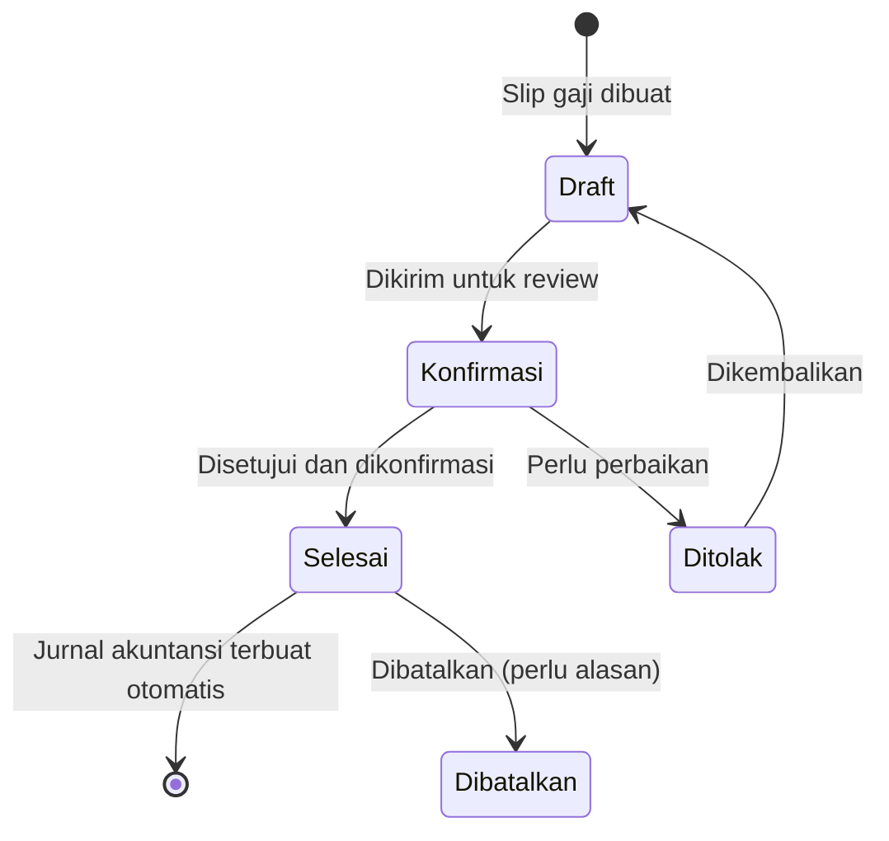

# Pemrosesan Slip Gaji Individual

Pemrosesan slip gaji secara individual cocok untuk perusahaan dengan **sedikit karyawan** atau ketika perlu memproses slip gaji **satu per satu** (misalnya koreksi atau penambahan bonus khusus).

---

## Prasyarat

Sebelum membuat slip gaji, pastikan:

- [ ] Karyawan memiliki **perjanjian gaji aktif** (atau struktur gaji dikonfigurasi manual di profil karyawan)
- [ ] Tipe Slip Gaji sudah dikonfigurasi dengan jurnal akuntansi yang benar
- [ ] Periode penggajian sudah ditentukan

---

## Alur Slip Gaji

---

## Cara Membuat Slip Gaji

**Menu:** `Penggajian > Slip Gaji > Baru`

### Langkah 1 — Isi Data Utama

| Field | Cara Mengisi |
|---|---|
| **Tipe Slip Gaji** | Pilih tipe yang sesuai, misalnya `Slip Gaji Bulanan` |
| **Karyawan** | Pilih karyawan |
| **Struktur Gaji** | Otomatis terisi dari perjanjian aktif. Jika tidak, pilih manual. |
| **Tanggal Mulai Periode** | Awal periode penggajian, misal `01/01/2025` |
| **Tanggal Selesai Periode** | Akhir periode penggajian, misal `31/01/2025` |
| **Tanggal Akuntansi** | Tanggal jurnal akuntansi akan dibuat, biasa diisi tanggal akhir bulan |

!!! example "Contoh Pengisian"
    | Field | Nilai |
    |---|---|
    | Tipe Slip Gaji | `Slip Gaji Bulanan` |
    | Karyawan | `Budi Santoso` |
    | Struktur Gaji | `Gaji Operator Produksi` *(terisi otomatis)* |
    | Tanggal Mulai Periode | `01/01/2025` |
    | Tanggal Selesai Periode | `31/01/2025` |
    | Tanggal Akuntansi | `31/01/2025` |

---

### Langkah 2 — Verifikasi Komponen Gaji

Setelah data utama diisi dan disimpan, buka tab **Komponen Gaji** (Payslip Lines). Semua komponen gaji berdasarkan struktur karyawan akan sudah otomatis terhitung.

Verifikasi bahwa:
- Gaji pokok sesuai dengan perjanjian
- Semua tunjangan muncul dengan nilai yang benar
- Potongan (BPJS, dll.) terhitung dengan benar
- Total gaji bersih masuk akal

!!! example "Contoh Komponen yang Seharusnya Muncul"
    Untuk Budi Santoso dengan struktur `Gaji Operator Produksi`:

    | Komponen | Nilai |
    |---|---|
    | Gaji Pokok | Rp 4.000.000 |
    | Tunjangan Transportasi | Rp 500.000 |
    | Tunjangan Makan | Rp 300.000 |
    | BPJS Kesehatan Karyawan | − Rp 48.000 |
    | BPJS TK JHT Karyawan | − Rp 96.000 |
    | **Gaji Bersih** | **Rp 4.656.000** |

---

### Langkah 3 — Tambahkan Input Variabel (Jika Ada)

Jika bulan ini ada nilai tambahan yang tidak ada di perjanjian gaji, tambahkan di tab **Input**:

| Contoh Input Variabel | Nilai |
|---|---|
| Lembur Januari | Rp 250.000 |
| Bonus Tahun Baru | Rp 500.000 |
| Potongan Tidak Masuk (2 hari) | − Rp 200.000 |

Setelah menambah input variabel, komponen gaji akan dihitung ulang secara otomatis.

---

### Langkah 4 — Konfirmasi Slip Gaji

Setelah verifikasi selesai:

1. Klik tombol **Konfirmasi**
2. Dokumen masuk ke status **Konfirmasi**
3. Manajer yang berwenang mereview dan menyetujui

---

### Langkah 5 — Persetujuan dan Pengesahan

Manajer HR/Keuangan yang berwenang akan:

1. Membuka slip gaji yang perlu disetujui
2. Mereview semua komponen
3. Klik **Setujui** → Status berubah ke **Selesai (Done)**

Ketika slip gaji **Selesai (Done)**:
- Sistem otomatis membuat **jurnal akuntansi** untuk biaya gaji
- Slip gaji tidak bisa diedit lagi

---

## Mencetak Slip Gaji

Setelah slip gaji selesai, cetak untuk diserahkan kepada karyawan:

1. Buka slip gaji yang sudah dalam status **Selesai**
2. Klik tombol **Cetak** (Print)
3. Pilih format laporan yang tersedia

---

## Membatalkan Slip Gaji

Jika ada kesalahan setelah slip gaji selesai, slip bisa dibatalkan:

1. Buka slip gaji yang akan dibatalkan
2. Klik **Batalkan** (Cancel)
3. Konfirmasi pembatalan

!!! warning "Dampak Pembatalan"
    Membatalkan slip gaji akan **membalik jurnal akuntansi** yang sudah dibuat. Setelah dibatalkan, status kembali ke **Draft** dan bisa diedit ulang, kemudian diproses kembali dari awal.

---

## Reset Nomor Dokumen

Dalam kondisi tertentu, nomor dokumen slip gaji mungkin perlu direset (misalnya pada awal tahun baru). Fitur **Reset Nomor** tersedia jika dikonfigurasi dalam kebijakan sistem.

!!! note "Konsultasi dengan Admin"
    Fitur reset nomor biasanya hanya digunakan dalam kondisi khusus dan sebaiknya dikonsultasikan dengan administrator sistem sebelum digunakan.
