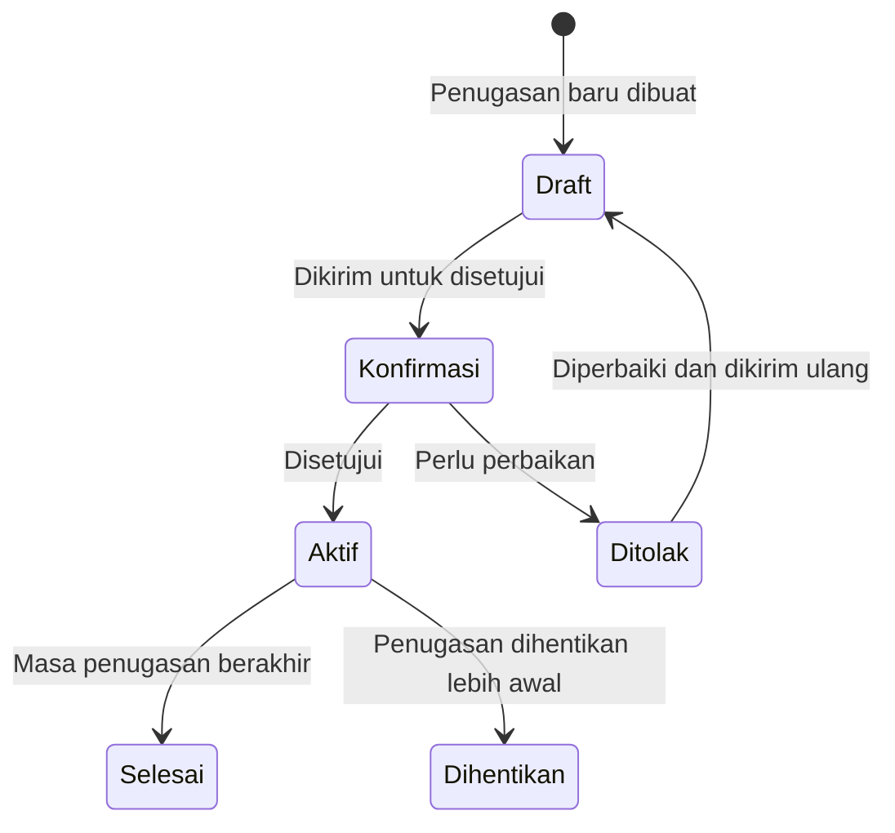

# Penugasan Karyawan ke Klien

Dokumen **Penugasan Karyawan Eksternal** mencatat secara resmi di mana seorang karyawan ditempatkan. Setiap karyawan hanya boleh memiliki **satu penugasan aktif** pada satu waktu.

---

## Prasyarat

Sebelum membuat penugasan, pastikan hal-hal berikut sudah siap:

- [ ] Karyawan sudah terdaftar di Odoo (modul HR)
- [ ] Klien sudah terdaftar sebagai mitra (partner) di Odoo
- [ ] Tipe penugasan yang sesuai sudah dikonfigurasi
- [ ] Karyawan yang bersangkutan belum memiliki penugasan aktif lain

---

## Alur Penugasan

---

## Cara Membuat Penugasan Baru

**Menu:** `Pegawai > Penugasan Karyawan Eksternal > Baru`

### Mengisi Form Penugasan

**Bagian Header (Informasi Utama)**

| Field | Cara Mengisi |
|---|---|
| **Tipe Penugasan** | Pilih tipe yang sesuai (menentukan karyawan & klien yang tersedia) |
| **Karyawan** | Pilih karyawan (daftar sudah difilter berdasarkan tipe) |
| **Klien (Partner)** | Pilih klien tujuan penugasan |
| **Lokasi Klien** | Pilih lokasi spesifik (jika klien memiliki beberapa lokasi) |
| **Tanggal** | Tanggal dokumen dibuat (default hari ini) |
| **Tanggal Mulai** | Tanggal karyawan mulai bekerja di klien |
| **Tanggal Selesai** | Tanggal berakhir penugasan (opsional, bisa dikosongkan jika belum pasti) |

!!! example "Contoh Pengisian"
    | Field | Nilai |
    |---|---|
    | Tipe Penugasan | `Penugasan Operator - Klien Industri` |
    | Karyawan | `Budi Santoso` |
    | Klien | `PT. Karya Utama` |
    | Lokasi Klien | `PT. Karya Utama - Pabrik Karawang` |
    | Tanggal | `01/01/2025` |
    | Tanggal Mulai | `01/01/2025` |
    | Tanggal Selesai | *(kosong)* |

---

### Konfirmasi Penugasan

1. Klik tombol **Konfirmasi** untuk mengirimkan dokumen ke proses persetujuan
2. Dokumen masuk ke status **Konfirmasi**

---

### Persetujuan Penugasan

Tergantung konfigurasi alur persetujuan, manajer yang berwenang akan:

- Klik **Setujui** → Dokumen berubah ke status **Aktif (Open)**
- Klik **Tolak** → Dokumen dikembalikan ke status **Draft** untuk diperbaiki

---

### Setelah Penugasan Aktif

Ketika penugasan sudah **Aktif**:

- Nomor dokumen digenerate otomatis oleh sistem
- Karyawan akan muncul sebagai "sedang ditempatkan di klien X"
- Pada profil karyawan, field `Penugasan Aktif` akan menampilkan penugasan ini

---

## Mengakhiri Penugasan

### Akhir Normal (Penugasan Selesai)

Jika masa penugasan berakhir sesuai rencana:

1. Buka dokumen penugasan yang bersangkutan
2. Klik **Selesai** (Done)
3. Konfirmasi bahwa penugasan benar-benar selesai

### Penghentian Lebih Awal (Terminate)

Jika penugasan perlu dihentikan sebelum tanggal yang direncanakan:

1. Buka dokumen penugasan yang bersangkutan
2. Klik **Hentikan** (Terminate)
3. Pilih atau isi **Alasan Penghentian**
4. Konfirmasi

!!! example "Contoh Alasan Penghentian"
    - Karyawan mengundurkan diri
    - Klien mengakhiri kontrak lebih awal
    - Karyawan dipindahkan ke klien lain
    - Pelanggaran kontrak

---

## Membuat Penugasan Baru Setelah Penugasan Sebelumnya Selesai

Setelah penugasan lama selesai/dihentikan, karyawan bisa mendapatkan penugasan baru ke klien yang berbeda (atau yang sama dengan periode baru).

!!! warning "Tidak Boleh Tumpang Tindih"
    Sistem tidak mengizinkan satu karyawan memiliki dua penugasan aktif sekaligus. Pastikan penugasan lama sudah dalam status **Selesai** atau **Dihentikan** sebelum membuat penugasan baru.

---

## Melihat Riwayat Penugasan Karyawan

Untuk melihat seluruh riwayat penugasan seorang karyawan:

1. Buka profil karyawan (`Pegawai > Karyawan`)
2. Klik tab **Penugasan**
3. Semua penugasan karyawan tersebut akan tampil, termasuk yang sudah selesai

---

## Mencari Penugasan Aktif per Klien

Untuk mengetahui karyawan mana saja yang sedang ditempatkan di klien tertentu:

**Menu:** `Pegawai > Penugasan Karyawan Eksternal`

Filter dengan:
- **Status:** Aktif (Open)
- **Klien:** pilih klien yang diinginkan

!!! tip "Laporan Penugasan"
    Daftar ini berguna saat membuat invoice ke klien, karena dari sinilah Anda tahu berapa karyawan yang aktif di klien tersebut pada bulan tertentu.
