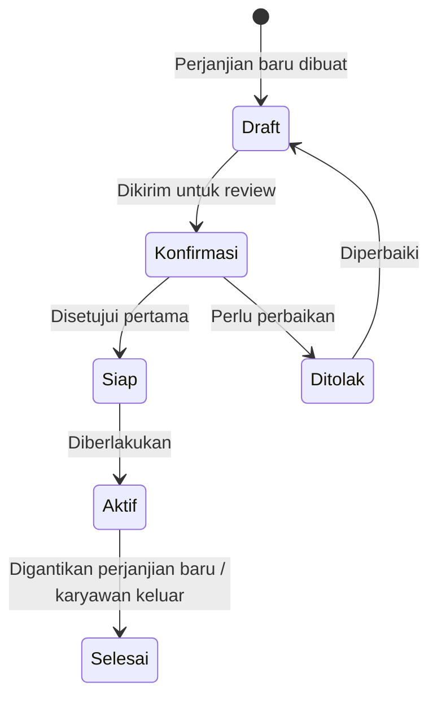

# Perjanjian Gaji Karyawan

**Perjanjian Gaji** adalah dokumen resmi yang menetapkan skema gaji yang berlaku untuk seorang karyawan. Perjanjian ini menjadi **dasar perhitungan slip gaji** selama perjanjian tersebut aktif.

---

## Prasyarat

Sebelum membuat perjanjian gaji, pastikan:

- [ ] Karyawan sudah terdaftar di Odoo
- [ ] Struktur gaji yang sesuai sudah dikonfigurasi
- [ ] Tipe Input Gaji yang diperlukan sudah dikonfigurasi
- [ ] Tipe Perjanjian Gaji sudah dikonfigurasi
- [ ] Karyawan belum memiliki perjanjian gaji aktif lain (jika ini perjanjian pertama, abaikan)

---

## Alur Perjanjian Gaji

---

## Cara Membuat Perjanjian Gaji

**Menu:** `Penggajian > Perjanjian Penggajian > Baru`

### Mengisi Form Perjanjian

**Bagian Header**

| Field | Cara Mengisi |
|---|---|
| **Tipe Perjanjian** | Pilih tipe perjanjian yang sesuai |
| **Karyawan** | Pilih karyawan yang bersangkutan |
| **Tanggal** | Tanggal perjanjian dibuat |
| **Referensi** | Nomor referensi dokumen fisik (opsional) |

**Bagian Struktur Gaji**

| Field | Cara Mengisi |
|---|---|
| **Struktur Gaji** | Pilih struktur yang berlaku untuk karyawan ini |

Setelah struktur gaji dipilih, sistem akan **otomatis mengisi** daftar komponen gaji yang ada di struktur tersebut ke dalam tab **Komponen Gaji**.

!!! example "Contoh Pengisian Header"
    | Field | Nilai |
    |---|---|
    | Tipe Perjanjian | `Perjanjian Kerja Outsource Standar` |
    | Karyawan | `Budi Santoso` |
    | Tanggal | `01/01/2025` |
    | Struktur Gaji | `Gaji Operator Produksi` |

---

**Bagian Input Perjanjian**

Di tab **Input**, masukkan nilai-nilai yang bersifat spesifik untuk karyawan ini:

| Field | Nilai untuk Budi Santoso |
|---|---|
| Tipe Input | Nilai |
| `Gaji Pokok` | `Rp 4.000.000` |
| `Tunjangan Transportasi` | `Rp 500.000` |
| `Tunjangan Makan` | `Rp 300.000` |

!!! info "Input = Nilai Per Karyawan"
    Nilai yang dimasukkan di sini akan otomatis digunakan setiap kali slip gaji dibuat untuk karyawan ini, selama perjanjian ini dalam status **Aktif**.

---

### Konfirmasi Perjanjian

Setelah semua data terisi dengan benar:

1. Klik tombol **Konfirmasi**
2. Sistem memvalidasi data
3. Dokumen masuk ke status **Konfirmasi**

---

### Proses Persetujuan

Manajer yang berwenang akan mereview dan menyetujui perjanjian:

1. **Persetujuan Pertama** → Status berubah ke **Siap (Ready)**
   - Pada tahap ini, nomor perjanjian digenerate otomatis
2. **Pemberlakuan** → Klik **Aktifkan** → Status berubah ke **Aktif (Open)**

---

### Setelah Perjanjian Aktif

Ketika perjanjian sudah **Aktif**:

- Perjanjian ini akan muncul sebagai perjanjian aktif karyawan di profil karyawan
- Saat membuat slip gaji, sistem akan **otomatis menggunakan** struktur dan input dari perjanjian ini
- Pada profil karyawan, field **Metode Penggajian** akan otomatis berubah menjadi "Dari Perjanjian Gaji"

---

## Mengganti Perjanjian Gaji

Ketika karyawan mendapatkan kenaikan gaji atau perubahan skema, buat perjanjian baru:

1. Buat **perjanjian gaji baru** dengan nilai yang diperbarui
2. Proses alur persetujuan perjanjian baru hingga **Aktif**
3. Perjanjian lama akan otomatis berubah ke status **Selesai** ketika perjanjian baru diaktifkan

!!! warning "Jangan Edit Perjanjian Aktif"
    Perjanjian yang sudah dalam status **Aktif** tidak boleh diedit langsung. Untuk mengubah nilai gaji, selalu buat perjanjian baru. Ini menjaga jejak audit riwayat gaji karyawan tetap terjaga.

---

## Melihat Riwayat Perjanjian Karyawan

Untuk melihat seluruh riwayat perjanjian gaji seorang karyawan:

1. Buka profil karyawan (`Pegawai > Karyawan`)
2. Di tab **Penggajian**, klik tombol **Perjanjian Gaji**
3. Semua perjanjian akan ditampilkan dengan statusnya masing-masing

---

## Pertanyaan Umum

**Q: Bisakah karyawan tanpa perjanjian gaji dibuatkan slip gaji?**

A: Bisa, dengan cara manual — tetapi struktur gaji harus dipilih langsung di profil karyawan (metode "Manual"). Cara ini kurang direkomendasikan karena tidak ada dokumentasi perjanjian resmi.

**Q: Apakah perjanjian gaji berkaitan dengan penugasan ke klien?**

A: Secara teknis, keduanya adalah dokumen terpisah. Namun dalam praktik bisnis outsourcing, sebaiknya perjanjian gaji dibuat **setelah** penugasan aktif, karena nilai gaji sering kali tergantung pada klien tempat karyawan ditempatkan.

**Q: Bagaimana jika karyawan memiliki input yang berbeda di bulan tertentu (misalnya ada bonus)?**

A: Input yang sifatnya tetap (gaji pokok, tunjangan tetap) cukup dikonfigurasi di perjanjian gaji. Input yang berubah-ubah per bulan (bonus, lembur, potongan absen) dimasukkan langsung saat membuat slip gaji, bukan di perjanjian.
