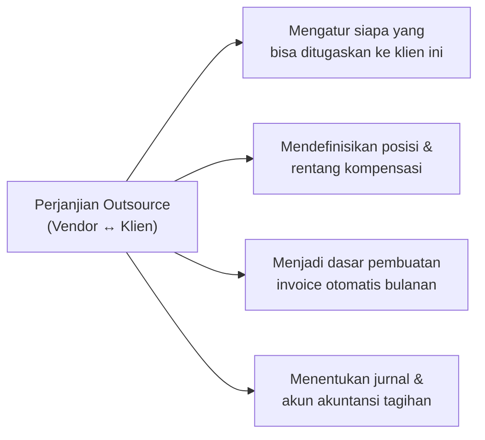
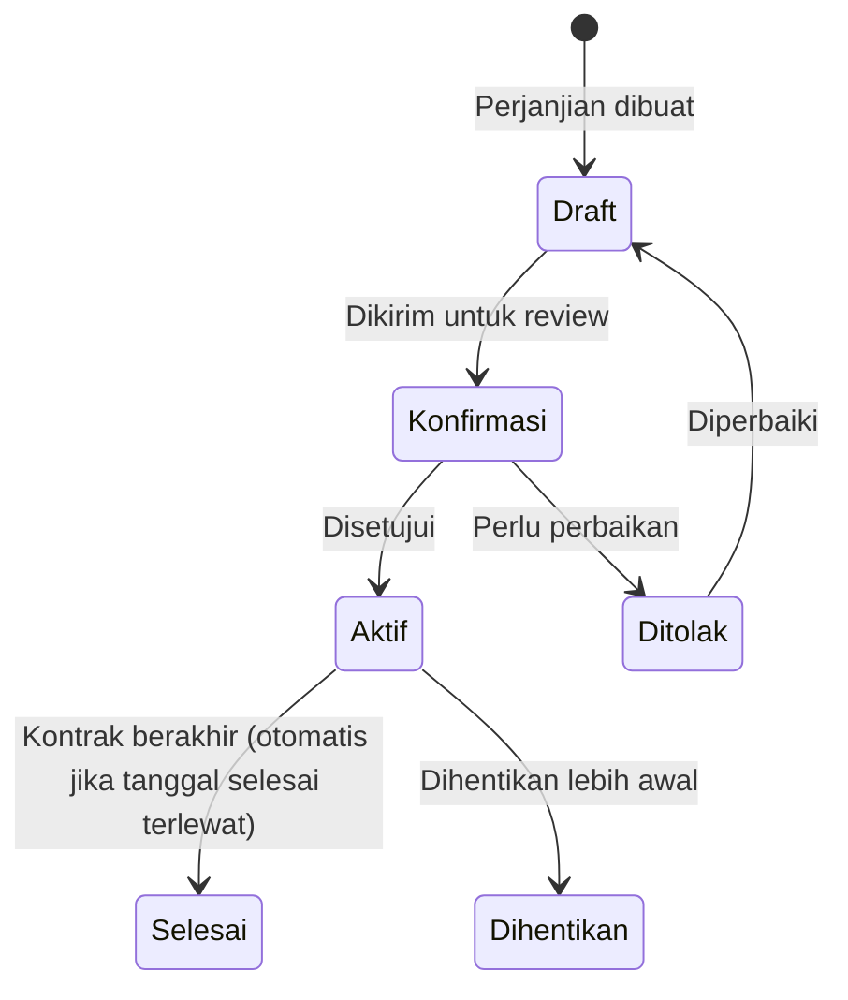

# Perjanjian Outsource Vendor–Klien

Dokumen **Perjanjian Outsource** (`employee_external_assignment_agreement`) adalah kontrak resmi antara PT. Maju Bersama (vendor) dengan klien. Perjanjian ini menjadi dasar hukum penempatan karyawan **dan** dasar pembuatan invoice secara otomatis di kemudian hari.

---

## Mengapa Perjanjian Ini Penting?

Tanpa perjanjian outsource yang aktif, penugasan karyawan tidak bisa dihubungkan ke klien, dan invoice tidak bisa digenerate otomatis.

---

## Prasyarat

Sebelum membuat perjanjian outsource, pastikan:

- [ ] Klien sudah terdaftar sebagai mitra (partner) di Odoo
- [ ] Tipe perjanjian sudah dikonfigurasi
- [ ] Komponen gaji (salary rules) yang akan ditagihkan sudah dikonfigurasi
- [ ] Posisi pekerjaan (jabatan) yang akan disediakan sudah ada di master data
- [ ] Jurnal akuntansi untuk invoice sudah disiapkan
- [ ] Akun piutang (receivable) sudah dikonfigurasi

---

## Alur Perjanjian Outsource

---

## Cara Membuat Perjanjian Outsource

**Menu:** `Human Resources > External Assignment > Agreements > Baru`

### Bagian Header

| Field | Cara Mengisi |
|---|---|
| **Tipe Perjanjian** | Pilih tipe sesuai kategori klien/pekerjaan |
| **Judul** | Nama deskriptif perjanjian |
| **Klien (Partner)** | Pilih klien dari daftar mitra |
| **Kontak Klien** | Narahubung di sisi klien |
| **Lokasi Klien** | Lokasi spesifik tempat karyawan bekerja |
| **Tanggal Mulai** | Tanggal mulai berlakunya perjanjian |
| **Tanggal Selesai** | Tanggal berakhirnya perjanjian (bisa dikosongkan) |

!!! example "Contoh Pengisian Header"
    | Field | Nilai |
    |---|---|
    | Tipe Perjanjian | `Outsourcing Industri Manufaktur` |
    | Judul | `Perjanjian Penyediaan Tenaga Kerja Outsource 2025` |
    | Klien | `PT. Karya Utama` |
    | Kontak Klien | `Bapak Hendra Wijaya (HRD Manager)` |
    | Lokasi | `PT. Karya Utama - Pabrik Karawang` |
    | Tanggal Mulai | `01/01/2025` |
    | Tanggal Selesai | `31/12/2025` |

---

### Tab Detail — Posisi dan Kompensasi

Di tab **Detail**, definisikan posisi-posisi pekerjaan yang vendor sediakan untuk klien ini.

Untuk setiap posisi, isi:

| Field | Keterangan |
|---|---|
| **Posisi (Jabatan)** | Jenis pekerjaan yang disediakan |
| **Kuota** | Jumlah maksimal karyawan yang bisa ditempatkan di posisi ini |
| **Termin Kompensasi** | Rentang nilai per komponen gaji untuk posisi ini |

!!! example "Contoh Detail Posisi"
    **Posisi: Operator Produksi** — Kuota: 5 orang

    | Komponen Gaji | Min | Max |
    |---|---|---|
    | Gaji Pokok | Rp 4.000.000 | Rp 5.000.000 |
    | Tunjangan Transportasi | Rp 400.000 | Rp 600.000 |
    | Tunjangan Makan | Rp 300.000 | Rp 300.000 |

    **Posisi: Supervisor Produksi** — Kuota: 1 orang

    | Komponen Gaji | Min | Max |
    |---|---|---|
    | Gaji Pokok | Rp 6.500.000 | Rp 8.000.000 |
    | Tunjangan Jabatan | Rp 1.000.000 | Rp 1.500.000 |

!!! info "Fungsi Rentang Kompensasi"
    Rentang kompensasi di perjanjian outsource **bukan yang menentukan gaji karyawan** — nilai gaji aktual ada di perjanjian gaji karyawan. Rentang ini digunakan sebagai referensi negosiasi dengan klien dan validasi bahwa nilai gaji karyawan masih dalam batas yang disepakati.

---

### Tab Biaya Lainnya (Other Fee)

Selain kompensasi karyawan, tambahkan biaya-biaya lain yang akan ditagihkan ke klien:

| Field | Keterangan |
|---|---|
| **Produk** | Jenis layanan/biaya (mis. "Biaya Administrasi SDM") |
| **Harga Satuan** | Nilai biaya |
| **Kuantitas** | Jumlah |
| **Pajak** | PPN atau pajak lain yang berlaku |
| **Akun** | Akun pendapatan untuk biaya ini |

!!! example "Contoh Biaya Lainnya"
    | Produk | Harga | Qty | Total |
    |---|---|---|---|
    | Biaya Administrasi SDM | Rp 500.000 | 1 | Rp 500.000 |
    | Biaya Rekrutmen (sekali bayar) | Rp 1.000.000 | 5 | Rp 5.000.000 |

---

### Tab Konfigurasi Akuntansi

| Field | Cara Mengisi |
|---|---|
| **Jurnal Invoice** | Jurnal yang digunakan saat invoice dibuat ke klien ini |
| **Akun Piutang** | Akun AR khusus untuk tagihan ke klien ini |
| **Akun Analitik** | Pusat biaya/profit center untuk klien ini (opsional) |

!!! warning "Konfigurasi Akuntansi Wajib Diisi"
    Tanpa jurnal dan akun piutang yang dikonfigurasi, sistem tidak bisa membuat invoice secara otomatis saat termin pembayaran dikonfirmasi.

---

### Konfirmasi dan Setujui Perjanjian

1. Klik **Konfirmasi** — dokumen masuk ke antrian persetujuan
2. Manajemen mereview dan menyetujui
3. Dokumen berubah ke status **Aktif (Open)**
4. Nomor dokumen digenerate otomatis (format: `EEAA/2025/000001`)

---

## Melihat Karyawan yang Ditugaskan

Setelah perjanjian aktif dan karyawan mulai ditugaskan, Anda dapat memantau:

- **Kuota terisi:** Di tab Detail, kolom `Terisi` menunjukkan berapa karyawan sudah ada di posisi tersebut
- **Daftar penugasan:** Tab **Penugasan** menampilkan semua penugasan karyawan yang terhubung ke perjanjian ini

---

## Mengelola Termin Pembayaran

Di tab **Termin Pembayaran**, Anda bisa melihat semua termin pembayaran (billing period) yang sudah dibuat untuk perjanjian ini.

Untuk menambahkan termin baru:

1. Klik **Tambah Termin Pembayaran**
2. Isi periode dan konfigurasi
3. Proses load data dan buat invoice

Lihat panduan lengkap di halaman [Invoicing ke Klien](invoicing-klien.md).

---

## Memperpanjang atau Mengganti Perjanjian

### Perpanjangan Perjanjian

Jika kontrak diperpanjang:

1. Edit perjanjian yang ada (saat masih **Draft** atau jika kebijakan sistem mengizinkan)
2. Atau buat perjanjian baru dengan periode baru

### Penghentian Perjanjian Lebih Awal

1. Buka perjanjian yang akan dihentikan
2. Klik **Hentikan** (Terminate)
3. Isi alasan penghentian

!!! warning "Dampak Penghentian Perjanjian"
    Menghentikan perjanjian outsource **tidak otomatis mengakhiri** penugasan karyawan yang terhubung. Anda perlu menyelesaikan penugasan masing-masing karyawan secara terpisah.

---

## Checklist Perjanjian Outsource

- [ ] Header (klien, tanggal, tipe) sudah diisi lengkap
- [ ] Tab Detail: semua posisi dan kuota sudah didefinisikan
- [ ] Tab Detail: rentang kompensasi per posisi sudah diisi
- [ ] Tab Konfigurasi Akuntansi: jurnal dan akun piutang sudah dipilih
- [ ] Perjanjian sudah disetujui dan berstatus Aktif
- [ ] Uji coba: buat satu penugasan karyawan dan hubungkan ke perjanjian ini
